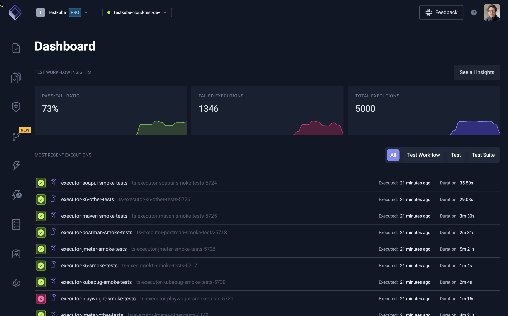

# Defining Tests

To be able to run your tests you’ll need to define your test executions, i.e., which testing tool, test repository and script/file, arguments/parameters, infrastructure, etc. This is commonly done in one of the following ways:

- Using a declarative mechanism, for example a YAML Workflow in GitHub.
- Using a scripting language, for example a Jenkin pipeline script (groovy).
- Using visual tools/plugins specific to your testing tool(s) and CI/CD systems.
- Any combination of the above - i.e., your CI/CD system might have a native plugin/action for one testing tool, but require you to create custom scripts/YAMLs for another.

It’s not uncommon to have multiple CI/CD tools in your infrastructure. For example, Jenkins for building your backend microservices and GitLab or a GitOps tool for building/deploying your front-end applications, which of course adds to the complexity of defining and maintaining (and running!) your test executions in a consistent way. 

Defining test executions is most commonly done by DevOps/Build engineers, based on requirements put forward by dev and QA teams.

## Defining Test Execution in Testkube

Testkube uses [Test Workflows](../articles/test-workflows.md) as a generic abstraction for defining how your tests are executed. Test Workflows uses a declarative YAML vocabulary specifically designed for executing tests, with built-in functionality for: 

- Retrieving tests from Git repositories, inline files and external volumes.
- Executing any test or testing tool available as a Docker image.
- Passing variables and arguments.
- Collecting results, artifacts and logs.
- Customizing the underlying pod/job resource configuration. 
- Orchestrating multiple test executions in sequence and parallel.
- Parallel execution of testing tools to 
generate massive load.
- Distribute executions to save time. 
- Setup/teardown of services your tests depend on.
- Etc.

Testkube also provides [Workflow Templates](../articles/test-workflow-templates.md) that can be used to define common traits for any of the above mentioned features, which can then be shared across multiple workflows, allowing you to ensure consistent usage of these features. For example you might define templates for accessing Git repositories, setting resource allocations or defining Docker images for your tests.

Testkube allows you to label your Test Workflows however needed, for example by target release, application or tool, allowing for flexible management of Workflows via a single dashboard where all workflows and their executions are available.

See our [Examples](../articles/test-workflows-examples-basics.md) section for details on how to run specific types of tests using common tools available today.

Read on about [Triggering Tests](../articles/triggering-tests.md).

