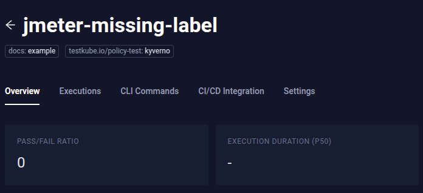
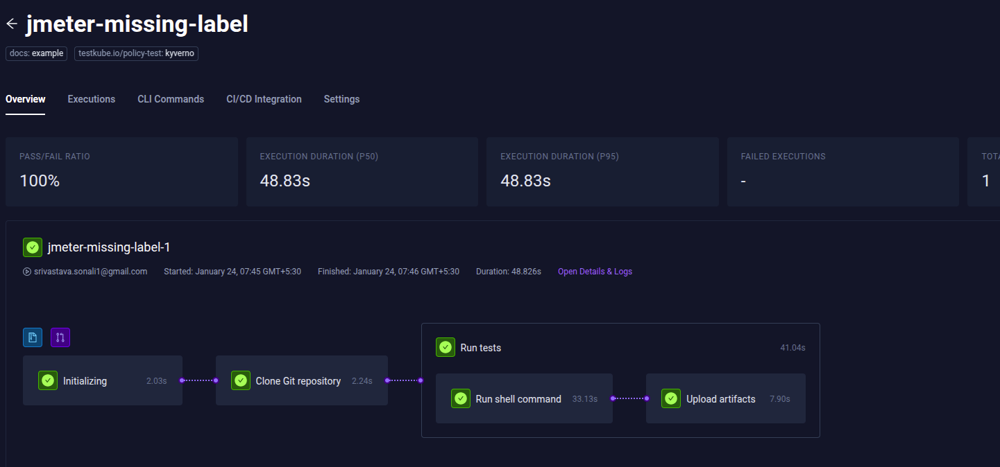

# Enforce Policies to Standardize Test Workflows

Policies are a set of rules based on compliance, guidance, or best practice guidelines that can be used to control the resource behavior on a Kubernetes cluster. To do so, you require an admission controller that can help enforce the policies on resources at the right time.

Popular policy engines like [Open Policy Agent (OPA)](https://www.openpolicyagent.org/docs/latest/) and [Kyverno](https://kyverno.io/docs/) provide robust implementations of admission controllers. While OPA offers a powerful policy language called Rego, Kyverno provides a more Kubernetes-native approach with YAML-based policies. Both tools are excellent choices for implementing Test Workflow standardization, with Kyverno being particularly user-friendly for teams already familiar with Kubernetes YAML.

## Enforce Testkube Workflow Policies using Kyverno

Kyverno is a policy engine that allows you to create policies as YAML-based declarative Kubernetes resources and enforce policies as a Kubernetes admission controller. Here are the different types of policies it supports:

* A [validate policy](https://kyverno.io/docs/writing-policies/validate/) defines a set of required criteria that a Kubernetes resource must meet during creation. The policy checks whether the resource configuration matches predefined standards or constraints. Kyverno offers different modes of policy enforcement:  
  * Enforce: Blocks resources that don't meet policy requirements  
  * Audit: Allows resource creation but logs violations

* A [mutate policy](https://kyverno.io/docs/writing-policies/mutate/) identifies resources that violate the predefined standards and makes precise changes to the resource being created.

In our demo, we'll showcase two practical policy implementation scenarios that address common challenges in Test Workflow management:

* Validating container image tags to ensure consistency and security for test execution.  
* Automatically adding standardized labels to Test Workflow to ensure consistent scheduling and reporting.

We will dig deeper into what these demonstrations are once we have met the requirements and have a cluster ready.

:::note
For a more in depth overview of Workflow Policy Enforcement with Kyverno please check out [Enforce Kubernetes Policies to Standardize Test Workflows](https://testkube.io/learn/enforce-kubernetes-policies-to-standardize-test-workflows)
:::

## Prerequisites

* Kubernetes cluster \- we’ll be using Minikube.  
* [Testkube account](https://testkube.io/get-started) and a Testkube Environment configured with [Testkube Agent](https://docs.testkube.io/testkube-cloud/articles/installing-agent).  
* [Testkube CLI](https://docs.testkube.io/articles/install/cli) and [kubectl](https://kubernetes.io/docs/reference/kubectl/), [Helm](https://helm.sh/docs/intro/install/) configured on your system.  
* The latest version of [Kyverno](https://kyverno.io/docs/installation/methods/) is installed.

Validate the status of Kyverno and Testkube installation.

```
$ kubectl get pods -n testkube  
NAME                                                    READY   STATUS    RESTARTS        AGE  
testkube-api-server-6b577fd8f6-gdlxz                    1/1     Running   2 (53s ago)     9d  
testkube-nats-0                                         2/2     Running   4 (53s ago)     9d  
testkube-operator-controller-manager-68868cc99b-tnlf6   2/2     Running     5 (25s ago)   9d

$ kubectl get pods -n kyverno  
NAME                                             READY   STATUS    RESTARTS        AGE  
kyverno-admission-controller-5fcbd69f8-2mggh     1/1     Running   2 (3m43s ago)   9d  
kyverno-background-controller-7fc586c8c5-27tb4   1/1     Running   2 (3m43s ago)   9d  
kyverno-cleanup-controller-8ffdc5bb8-x99mf       1/1     Running   2 (3m43s ago)   9d  
kyverno-reports-controller-7848888fdd-s5zf2      1/1     Running   2 (3m43s ago)   9d  
```

This should return the `Running` status for all relevant pods.

## Use Case1: Validate Image Tags in Test Workflows

One common requirement is ensuring that all Test Workflows use properly tagged images rather than the \`latest\` tag. This is because the latest tag always pulls the most recent image, which can lead to potential security risks from unverified image versions or unexpected behavior due to uncontrolled image updates.

Validate Policy allows us to check for non-compliant resources with the `latest` image tag and control their creation on the cluster. We can deny or allow their creation with a warning if they violate the policy. In this demo, here are the things we plan to do:

1. **Create a validate policy** that filters incoming requests for Test Workflow creation and defines rules to check the resource configuration does not use the `latest` image tag.  
2. **Enforce policy on Test Workflow** by deploying first the policy and then the Test Workflow on the cluster.

### Create Validate Policy

In this policy, we have defined that for a Test Workflow, check the usage of `latest` image tag and warn in case of violation.

```yaml  
apiVersion: kyverno.io/v1  
kind: ClusterPolicy  
metadata:  
  name: check-all-image-tags  
spec:  
  emitWarning: true  
  rules: 
    - name: validate-step-image  
      match:  
        resources:  
          kinds:  
            - TestWorkflow  
      validate:  
        failureAction: Audit  
        foreach:  
          - list: "request.object.spec.steps"  
            pattern:  
              =(container):  
                =(image): "!*:latest"  
          - list: "request.object.spec.steps"  
            pattern:  
              =(run):  
                =(image): "!*:latest"  
    - name: validate-container-image  
      match:  
        resources:  
          kinds:  
            - TestWorkflow  
      validate:  
        failureAction: Audit  
        pattern:  
           spec:  
             =(container):  
                =(image): "!*:latest"  
```

Let us understand the above policy:

* **spec.emitWarning**: Set to true to print the warning message. By default, all the violations of a policy are logged in the policy report.

* **spec.rules.match.resources.kinds**: Set to TestWorkflow to only intercept and apply this policy on Test Workflows.

* **spec.rules.validate**: Define multiple validate rules that check for image tag in the `spec.steps` and `spec`.

* **spec.rules.validate.pattern or spec.rules.validate.foreach.pattern:** Define the pattern to match like `spec.steps.container.image`, `spec.steps.run.image` or `spec.container.image`. The [equality anchor](https://kyverno.io/docs/writing-policies/validate/#anchors) `=()` helps ensure that the match processing happens only if tag exists.

* **spec.rules.validate.failureAction**: Set to Audit to only warn on non-compliance and allow Test Workflow creation. It can be set to `Enforce` to disallow the creation of resources for non-compliance.

Save the policy in [validate-all-image-tags.yaml](https://github.com/cerebro1/testkube-policies/blob/main/validate-all-image-tags/validate-all-image-tags.yaml) and apply it on the cluster.

```
$ kubectl apply -f validate-all-image-tags.yaml   
clusterpolicy.kyverno.io/check-all-image-tags configured  
```

The policy is successfully deployed on a Kubernetes cluster. Kyverno Reports Controller will require permission to create a [policy report](https://kyverno.io/docs/policy-reports/) so make sure you have [customized permissions](https://kyverno.io/docs/installation/customization/#customizing-permissions) to allow `kyverno-reports-controller` Service Account access to security-critical resources.

### Enforce Policy on Test Workflow

We have taken a sample Test Workflow and created two versions of it. Let us go ahead and apply these on the cluster.

* [tw-image-run-versioned.yaml](https://github.com/cerebro1/testkube-policies/blob/main/validate-all-image-tags/tw-image-run-versioned.yaml): Uses a version as an image tag in `spec.steps.run.image`  
    
  ```yaml  
   steps:  
      - name: Run k6 tests  
        run:  
          image: grafana/k6:0.54.0  
          shell: k6 run k6.js --iterations 100  
  ```  
  Apply the versioned image tag Test Workflow on the cluster.  
    
  ```  
  $ kubectl apply -f tw-image-run-versioned.yaml   
  testworkflow.testworkflows.testkube.io/testkube-run-versioned created  
  ```  
    
  This TestWorkflow successfully passed the policy check and has been created on the cluster.  
    
* [tw-image-run-latest.yaml](https://github.com/cerebro1/testkube-policies/blob/main/validate-all-image-tags/tw-image-run-latest.yaml): Uses latest as an image tag in `spec.steps.run.image`

  ```yaml
   steps:
      - name: Run k6 tests
        run:
          image: grafana/k6:latest
          shell: k6 run k6.js --iterations 100
  ```

  Apply the latest image tag Test Workflow on the cluster.


  ```
  $ kubectl apply -f tw-image-run-latest.yaml 
  Warning: policy check-all-image-tags.validate-step-image: validation failure: validation error: rule validate-step-image failed at path /run/image/
  testworkflow.testworkflows.testkube.io/testkube-run-latest created
  ```

  Kyverno intercepts the Test Workflow creation requests, checks the tag used in `run.image`, and throws a warning. Since we have set the policy in Audit mode hence the Test Workflow has been created but the violation has been logged.

### View Cluster Policy

You can manage and view the policies running on your cluster using `kubectl`.

1. Get the policies created on the cluster.  
   ```  
   kubectl get clusterpolicy  
   NAME                   ADMISSION   BACKGROUND   READY   AGE     MESSAGE  
   check-all-image-tags   true        true         True    5h37m   Ready  
   ```  
     
2. Check events for a policy.  
   ```  
   $ kubectl events --for clusterpolicy/check-all-image-tags  
   LAST SEEN   TYPE      REASON            OBJECT                               MESSAGE  
   28m         Warning   PolicyViolation   ClusterPolicy/check-all-image-tags   TestWorkflow testkube/testkube-run-latest: \[validate-step-image\] fail; validation failure: validation error: rule validate-step-image failed at path /run/image/  
   ```

The above output shows event was logged regarding Test Workflow which is non-compliant with this policy. You can also enable [Policy Reporter UI](https://kyverno.github.io/policy-reporter/#policy-reporter-ui) to manage policies running on your cluster.

## Use Case2: Mutate Test Workflows with Custom Labels

Mutate policies allow us to modify the Test Workflows that are non-compliant with the policy. In the mutate policy, we can configure the specifications that will be appended to the resource configuration when a resource creation request is initiated.

In this use case, we are going to discuss another common real-world example where we need to segregate resources based on labels and for that, you need to add standard labels to all Test workflow.

### Create Mutate Policy

In this policy, we have defined that for a Test Workflow, add a specific label if it does not exist in the resource configuration.

```yaml  
apiVersion: kyverno.io/v1  
kind: ClusterPolicy  
metadata:  
  name: mutate-testworkflow-label  
spec:  
  rules:  
    - name: add-mutated-label  
      match:  
        resources:  
          kinds:  
            - TestWorkflow  
      mutate:  
        patchStrategicMerge:  
          metadata:  
            labels:  
              +(testkube.io/policy-test): kyverno  
```  
Let us understand the above policy:

* **spec.rules.match.resources.kinds**: Set to TestWorkflow to only intercept and apply this policy on Test Workflows.

* **spec.rules.mutate**: Define mutate rule within this.

* **spec.rules.mutate.patchStrategicMerge**: Defines the content that will be merged to the element using [Strategic Merge Patch](https://kyverno.io/docs/writing-policies/mutate/#strategic-merge-patch).

* **+()**: Conditional logic that adds the label `[testkube.io/policy-test=kyverno](http://testkube.io/policy-test=kyverno)\` only if it does not exist in resource configuration.

Save the policy in [mutate-custom-label.yaml](https://github.com/cerebro1/testkube-policies/blob/main/mutate-custom-labels/mutate-custom-label.yaml) and apply it on the cluster.

```  
$ kubectl apply -f mutate-custom-label.yaml  
clusterpolicy.kyverno.io/mutate-testworkflow-label created  
```

The policy is successfully deployed on a Kubernetes cluster. Kyverno Reports Controller will require permission to create a [policy report](https://kyverno.io/docs/policy-reports/) so make sure you have [customized permissions](https://kyverno.io/docs/installation/customization/#customizing-permissions) to allow `kyverno-reports-controller` Service Account access to security-critical resources.

### Enforce Policy on Test Workflow

We have taken a sample Test Workflow: [tw-without-label.yaml](https://github.com/cerebro1/testkube-policies/blob/main/mutate-custom-labels/tw-without-label.yaml), which does not contain the expected label. Let us go ahead and apply these on the cluster.

```yaml
apiVersion: testworkflows.testkube.io/v1  
kind: TestWorkflow  
metadata:  
  name: jmeter-missing-label  
  namespace: testkube  
  labels:  
    docs: example  
```

Apply the Test Workflow without the expected label on the cluster.

```  
$ kubectl apply -f tw-without-label.yaml   
testworkflow.testworkflows.testkube.io/jmeter-missing-label created  
```

The Test Workflow is successfully applied on the cluster. Since the Kyverno policy to mutate labels already is deployed on the cluster, the Test Workflow specifications should have been updated.

### Verify Test Workflow mutation

Using the Testkube CLI, we can check the Test Workflow details as shown below:

```  
$ kubectl testkube get tw jmeter-missing-label

Context: cloud (2.1.60)   Namespace: testkube   Org: xxxxxxxxxxxxxxxx  Env: xxxxxxxxxxxxxxxxxx  
-------------------------------------------------------------------------------------------------------------------------  
Test Workflow:  
Name:      jmeter-missing-label  
Namespace: testkube  
Created:   2025-01-23 18:10:11 +0000 UTC

Labels:    docs=example, testkube.io/policy-test=kyverno  
```

In the Labels, you can verify that the custom label has been added successfully.

Access the Test Workflow in the Testkube Dashboard.



Trigger the first execution of Test Worklow from the Dashboard or you can use CLI as shown below:

```
$ kubectl testkube start tw jmeter-missing-label  
…  
Test Workflow Execution:  
Name:                 jmeter-missing-label  
Execution ID:         6792f7c35eae71edfaea514c  
Execution name:       jmeter-missing-label-1  
Execution namespace:    
Execution number:     1  
Requested at:         2025-01-24 02:15:31.484376794 +0000 UTC  
…  
Status:               queued

$ Watch test workflow execution until complete \\  
	kubectl testkube watch twe 6792f7c35eae71edfaea514c  
$ Use following command to get test workflow execution details \\  
	kubectl testkube get twe 6792f7c35eae71edfaea514c  
```

Check the status of execution using the commands mentioned in the above output:

```  
$ kubectl testkube get twe 6792f7c35eae71edfaea514c

Context: cloud (2.1.60)   Namespace: testkube   Org: xxxxxxxxxxxx   Env: xxxx  
--------------------------------------------------------------------  
Test Workflow Execution:  
Name:                 jmeter-missing-label  
Execution ID:         6792f7c35eae71edfaea514c  
Execution name:       jmeter-missing-label-1  
Execution namespace:    
Execution number:     1  
Requested at:         2025-01-24 02:15:31.484 +0000 UTC  
Disabled webhooks:    false  
Running context:       
Interface:             
  Type:               cli  
Status:               passed  
…  
Duration:             48.826s  
Getting logs for test workflow execution 6792f7c35eae71edfaea514c  
…  
Found and uploaded 129 files (3.0 MB).  
Took 6.888s.  
Test Workflow URI: https://app.testkube.io/organization/xxxx/test-workflows/jmeter-missing-label  
Test Workflow Execution URI: https://app.testkube.io/organization/xxx/jmeter-missing-label/xxxx  
• passed in 7.904s  
```

Use the above links to view the Test Workflow in the Testkube Dashboard.  


For Test Workflows that contain the expected label, Kyverno will not add to them based on the policy. You can verify this by applying this Test Workflow, [tw-with-label.yaml](https://github.com/cerebro1/testkube-policies/blob/main/mutate-custom-labels/tw-with-label.yaml) which has the label.

## Other Use Cases

The above examples just hint at the possibilities for using policies to enforce consistent and scalable usage of Testkube Workflows across teams and projects. Given the extensive functionality of Workflows, other examples could be:

- A policy to enforce correct usage of [Workflow Resource Constraints](https://docs.testkube.io/articles/test-workflows#resources) within defined limits  
- A policy to ensure only allowed [git repositories/branches](https://docs.testkube.io/articles/test-workflows-content#git-repository) are used for test scripts  
- A policy to ensure that [test parallelisation](https://docs.testkube.io/articles/test-workflows-parallel) or sharding does not use more than X nodes  
- A policy to ensure that [artifacts](https://docs.testkube.io/articles/test-workflows-artifacts) are collected from all test executions, etc.