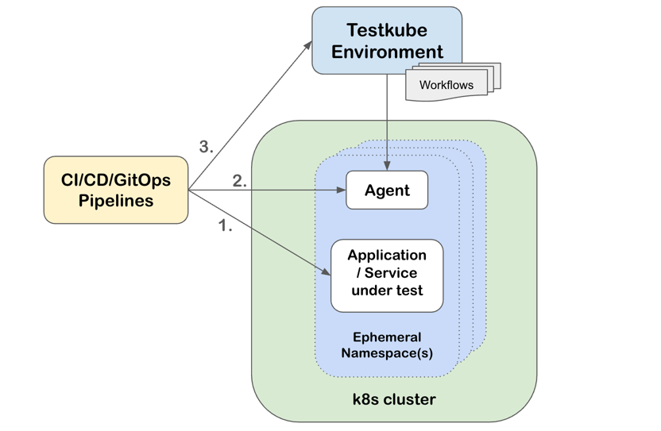

# Ephemeral Environments

While application namespaces/clusters are often long-lived (dev, staging, prod, etc.), it is equally common to provision short-lived
clusters and/or namespace for pull-requests, local sandboxes, etc. 

Using Testkube to run tests in these ephemeral namespaces/clusters can be achieved using both multi and single-agent setups. 

## Multi-Agent Approach

With the addition of [Multi-Agent Environments](/articles/install/multi-agent) to Testkube, supporting ephemeral/short-lived 
namespaces/clusters is straight-forward:

1. Provision your ephemeral namespace/cluster and application as desired using the tool of your choice.
2. Create a corresponding Runner Agent in the same namespace/cluster as described at [Independent Runners](/articles/install/multi-agent#independent-runners).
3. Run your Workflows on this Agent using the corresponding [targeting arguments](/articles/install/multi-agent#runner-targeting), the execution results will 
   be aggregated on the Control Plane as before and contain metadata on which Agent they were executed.
4. [Remove the Agent](/articles/multi-agent-cli#deleting-and-uninstalling-a-runner-agent) and tear down your namespace/cluster when finished.
5. View the results/artifacts/resource-usage of your Workflow Executions in the Testkube Dashboard as before.

Steps 2, 3 and 4 above can all be automated via the Testkube CLI in your CI/CD pipelines; the following diagram describes this setup.



## Single Agent Approach

If you are not able to install a dedicated Runner Agent for each ephemeral namespace/cluster, you can
use Testkubes `executionNamespace` with the Standalone Agent instead:

- Install the Standalone Agent for your Testkube Environment in a dedicated namespace in the same cluster(s) that 
  you will be provisioning ephemeral namespaces, make sure [Namespaces for Test Execution](/articles/install/advanced-install#namespaces-for-test-execution)
  are set accordingly.
- Use the `executionNamespace` property in your Workflows to configure in which namespace they should execute,  
  either statically or dynamically as shown below.
- Trigger the execution of these Workflows as you would normally from CI/CD, Kubernetes Events, etc. 


### Runtime `executionNamespace` configuration

To reuse a Workflow across any number of ephemeral namespaces, you can specify a corresponding 
[configuration parameter](/articles/test-workflows-examples-configuration) in your Workflow:

```yaml
kind: TestWorkflow
metadata:
  name: example
spec:
  config:
    namespace:
      type: string
  job:
    namespace: "{{ config.namespace }}"
```

and then specify the namespace at runtime, together with any other configuration parameters:

```
testkube run tw my-workflow --config namespace=pr_1234
```
