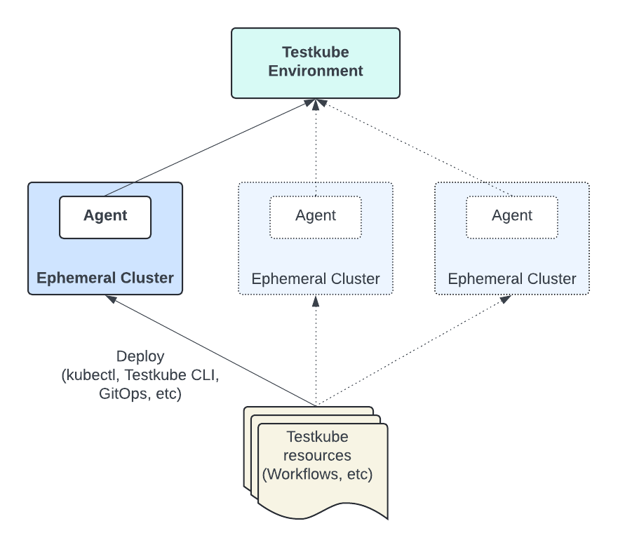
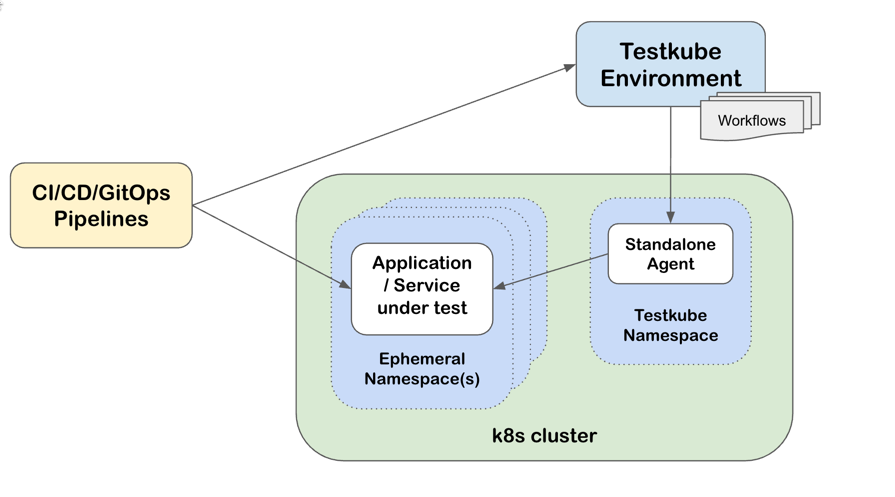

# Ephemeral Environments

Testkube expects your Environments and their corresponding Testkube Agent/Cluster to be long-lived - 
for example a staging or testing Environment where test execution results are aggregated over time to allow for 
continuous testing, troubleshooting, analytics, reporting, etc. 

Another common use-case on the other hand is **ephemeral environments**, i.e. environments that are temporary and 
short-lived, for example when testing changes in a Pull/Merge Request or for running system and acceptance tests 
before releasing new functionality.

These environments can be backed by either a (temporary) cluster or namespace, let's have a look at how Testkube
currently supports these two cases.

## 1. Ephemeral Clusters
 
Ephemeral clusters would potentially require you to define a new Testkube Environment, install the Agent, 
configure/run tests, etc. for each ephemeral cluster created in your development workflows. Furthermore, 
once the ephemeral cluster is removed, the corresponding Testkube Environment will have to be kept for as long as
the contained Test Execution results are required, potentially resulting in a large number of environments,
which becomes both costly and difficult to manage over time.

A preferred solution would be a single Testkube Environment to which any number of Testkube Agents (deployed
in ephemeral clusters) can connect and report test execution results as they come and go. Unfortunately though,
this approach is currently constrained by how Testkube works today:

- Testkube Environments can currently only handle a single connected agent at a time. 
- Testkube resources (Workflows, Triggers, etc.) are stored in the clusters themselves and not in the Control Plane, 
  so that when a new agent in an ephemeral cluster connects, it won't contain any tests/triggers/etc to run.

Given these constraints let's look at one can "re-use" a single Agent across multiple ephemeral clusters.

### Re-using agents within an Environment

If you can comply with the constraint of only one agent connected to a Testkube Environment at a time, you 
can simply re-use the agent installation command across multiple clusters in your development pipelines:

1. [Create a Testkube Environment](/testkube-pro/articles/environment-management#operation/updateEnvironment) as usual via the Dashboard
2. Reuse the generated command for connecting an agent for all clusters that should connect to this Environment. 

### Provisioning and execution of Testkube resources

Once the agent has been installed on a new ephemeral cluster, that cluster will not contain any Testkube resources 
for it to run/manage; these need to be installed in the cluster for the agent to run and manage. Since Testkube 
resources are standard Kubernetes CRDs ([Read More](http://localhost:3000/articles/crds)), this can be achieved in 
several ways, for example:

- By automating `kubectl apply` commands for the resources that are need to run your tests in your CI/CD workflows.
- By storing these resources in Git and using a GitOps tool like ArgoCD or Flux to deploy them into your cluster.

The below diagram describes this approach at a high level:



### Triggering provisioned resources

Once your Testkube resources have been created in your ephemeral cluster and the agent has connected to its 
Testkube Environment, you can trigger/use them in any way supported by Testkube. In case of Workflows, you 
might use a GitOps approach to deploy [Execution CRDs](/articles/test-executions) to trigger their execution, 
trigger Test Executions [from CI/CD](/articles/cicd-overview), or simply use/automate the 
Testkube CLI [run command](/cli/testkube_run) in your CI/CD pipeline.

If your Testkube resources contain [Kubernetes Event Triggers](/articles/test-triggers), these will be triggered accordingly.

### Aggregating results

The Testkube Dashboard will aggregate and show test execution results from each ephemeral cluster as its Testkube Agent 
connects and executes its Workflows. 

:::info
Testkube identifies execution results by the name of their Workflow, so as long as the Workflows have the same name
across all your environments, they will be aggregated and shown in the Dashboard under the corresponding Workflow.
:::

## 2. Ephemeral Namespaces

Instead of provisioning ephemeral clusters it is not uncommon to use ephemeral namespaces within an existing cluster
for the same purpose. Combined with Testkubes `executionNamespace` functionality you can in this scenario avoid
having to install the Testkube Agent in each ephemeral namespace;

- Install the Agent and all required Testkube resources in a dedicated namespace (`testkube` by default).
- Use the `executionNamespace` property to execute your Workflow in other (ephemeral) namespaces.
- Trigger the execution of these Workflows as you would normally from CI/CD, Kubernetes Events, etc. 




### Runtime `executionNamespace` configuration

To reuse a Workflow across any number of ephemeral namespaces, you can specify a corresponding 
configuration parameter in your Workflow:

```yaml
kind: TestWorkflow
metadata:
  name: example
spec:
  config:
    namespace:
      type: string
  job:
    namespace: "{{ config.namespace }}"
```

and then specify the namespace at runtime, together with any other configuration parameters:

```
testkube run tw my-workflow --config namespace=PR_1234
```

## Alternative approaches

More elaborate approaches involving the Tetstkube API to automate the creation and management of 
ephemeral Testkube Environments are definitely possibly but depend greatly on specific pipeline needs
and requirements, please don't hesitate to get in touch on 
our [Slack Community](https://bit.ly/testkube-slack) or by [Getting in touch](https://testkube.io/contact) to
discuss how Testkube can fit into your infrastructure.

:::info
The Testkube team is looking into adding true multi-agent support to Testkube Environments - let us know if you have
any specific requirements in this regard so we can make sure to cover them also.
:::
