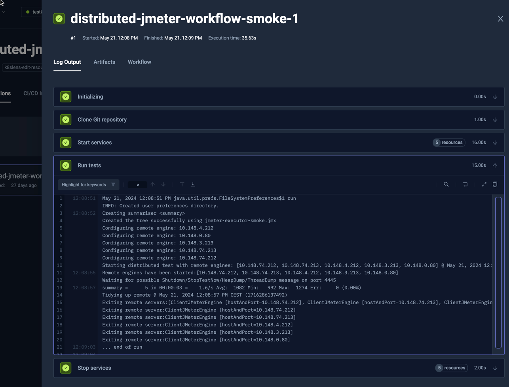

import Tabs from "@theme/Tabs";
import TabItem from "@theme/TabItem";
import DistributedJMeter from "../../workflows/distributed-jmeter-workflow.md"

# Distributed JMeter Example

import RequiresCommercialWorkflows from "../_commercial-workflows-note.mdx"

<RequiresCommercialWorkflows/>

Testkube has built-in support for parallelising any testing tool - check out the
[Parallelization](../test-workflows-parallel) documentation for details and examples. 

The below example shows how to distribute a JMeter test across a configurable
number of nodes

* Read JMX configuration from Git repository (`spec.content.git`)
* Start 5 remote workers (`spec.services.slave.count`)
  * Distribute them evenly across nodes (`spec.services.slave.use[0]` - `distribute/evenly` template is setting common [`pod.topologySpreadConstraints`](https://kubernetes.io/docs/concepts/scheduling-eviction/topology-spread-constraints/))
  * Reserve 1/8 CPU and 128MB memory for each instance (`spec.services.slave.container.resources`)
  * Wait until they will accept connection at port 1099 (`spec.services.slave.readinessProbe`)
* Run JMeter controller against all the remote workers (`spec.services.steps[0].run`)
  * It uses `{{ services.slave.*.ip }}` as an argument - `services.slave.*.ip` will return list of IPs, and they will be joined by comma (`,`) to convert to text

<DistributedJMeter/>

The Log Output from this test:

