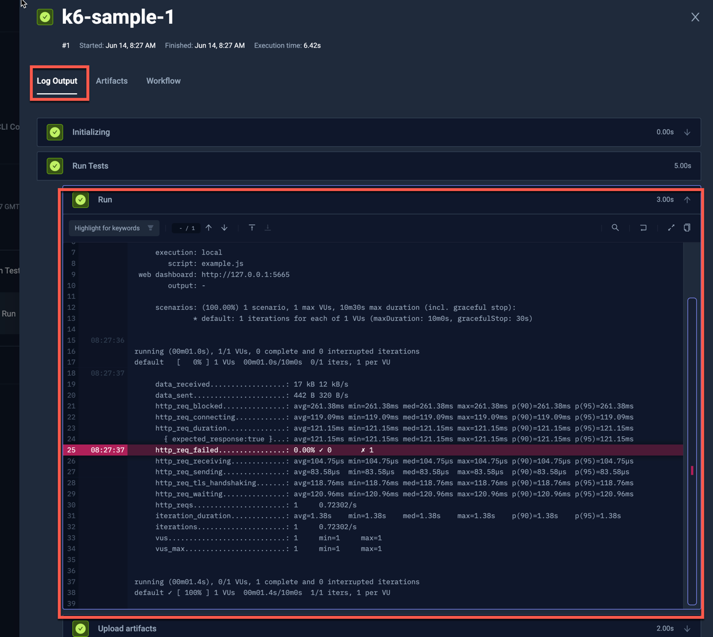

import Tabs from "@theme/Tabs";
import TabItem from "@theme/TabItem";
import SimpleK6 from "../../workflows/simple-k6-workflow.md"
import SimpleK6FromTemplate from "../../workflows/simple-k6-workflow-from-template.md"

# Basic K6 Example

Below is a simple workflow for executing an inline K6 test. You can paste this directly into the YAML of an existing or new test, just make 
sure to update the `name` and `namespace` for your environment if needed.

- The `spec.content` property defines a simple k6 script which gets written to `/data/example.js`
- the `spec.steps` property defines a single step that runs the test and uploads the created report.

<SimpleK6/>

After execution, you can see the output from the test executions under the executions panel tabs:

<Tabs>
<TabItem value="logs" label="Log Output" default>

The log output from k6:

</TabItem>
<TabItem value="artifacts" label="Artifacts" default>

The uploaded report is available in the Artifacts tab:

</TabItem>

<TabItem value="htlm-report" label="HTLM Report" default>

Clicking the HTLM report opens it in your browser:

</TabItem>
</Tabs>

## Basic K6 from Template
Below is an example workflow for executing the K6 test using an official Testkube Template.

<SimpleK6FromTemplate/>
