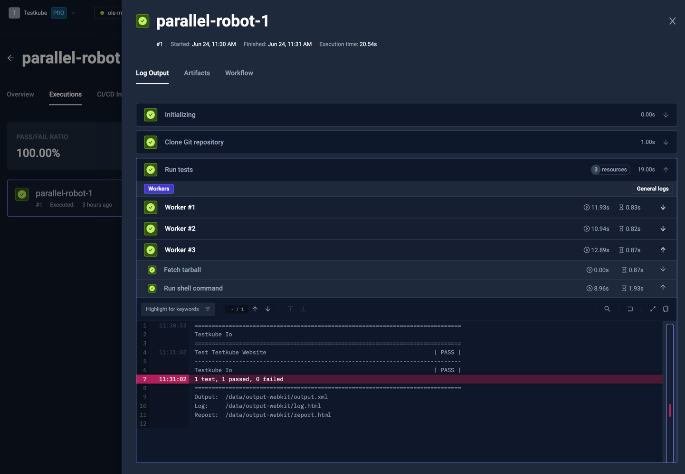
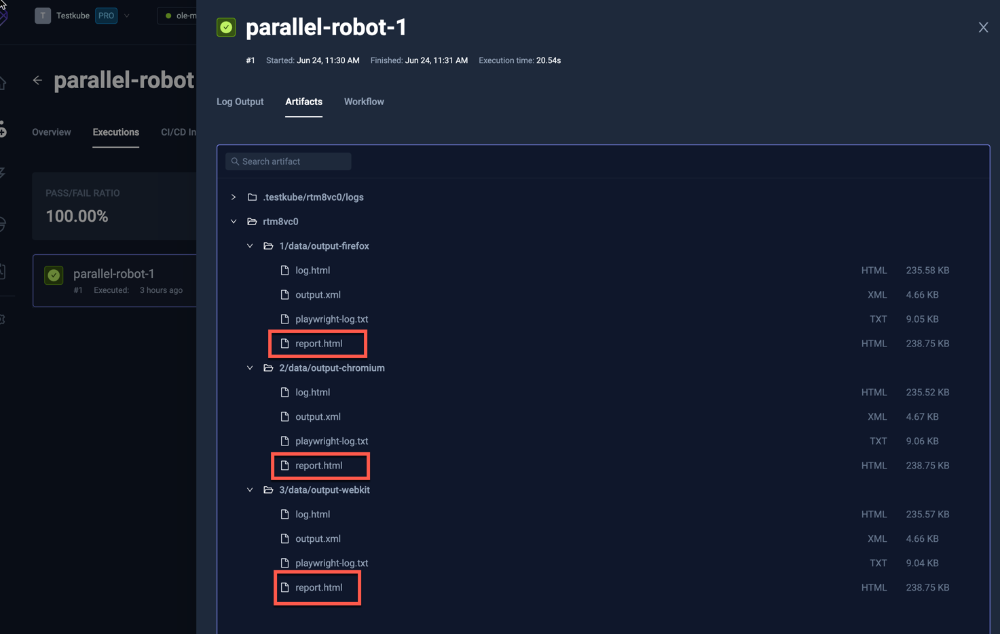
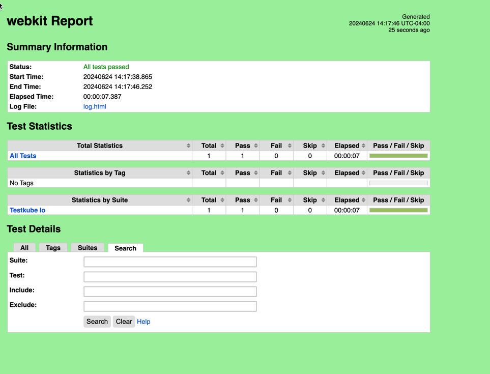

import Tabs from "@theme/Tabs";
import TabItem from "@theme/TabItem";
import ParallelRobotFramework from "../../workflows/parallel-robot-framework-workflow.md"

# Parallelized Robot Framework Example

Below is a simple workflow for executing a Robot Framework test on three browsers running 
in parallel instead of sequentially. You can paste this directly into the YAML of an existing or new test, just make
sure to update the `name` and `namespace` for your environment if needed.

- The `spec.content` property defines the location of the GitHub project
- the `spec.steps` property defines a single step that runs the test and uploads the created reports.
- The `spec.steps.[0].parallel` property defines the robot steps to run in parallel
- The `spec.steps.[0].parallel.matrix` defines a browser property with values for each browser
- The `spec.steps.[0].parallel.steps.[0].shell` property runs the robot test for a specific browser

<ParallelRobotFramework/>

After execution, you can see the output from the test executions under the executions panel tabs:

<Tabs>
<TabItem value="logs" label="Log Output" default>

The log output from the Robot Framework execution:

</TabItem>
<TabItem value="artifacts" label="Artifacts" default>

The uploaded report is available in the Artifacts tab:

</TabItem>

<TabItem value="htlm-report" label="HTLM Report" default>

Clicking the HTLM report opens it in your browser:

</TabItem>
</Tabs>

