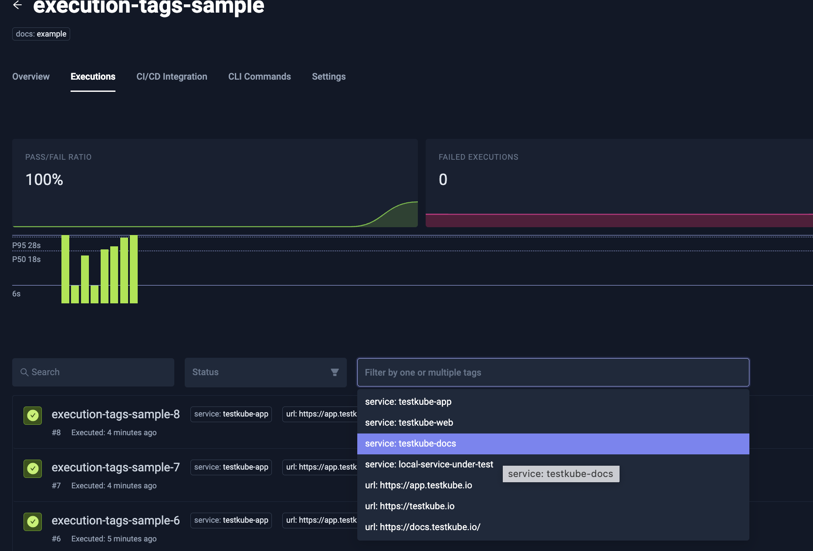

# Filtering Test Workflow Executions using Tags

This example shows how to use execution tags in your test workflows to easily filter and view executions.

## Example Workflow

```yaml
kind: TestWorkflow
apiVersion: testworkflows.testkube.io/v1
metadata:
  name: execution-tags-sample
  labels:
    docs: example
spec:
  config:
    serviceUnderTest:
      type: string
      default: local-service-under-test
    targetUrl:
      type: string
      default: https://testkube.io
  execution:
    tags:
      service: '{{config.serviceUnderTest}}'
      url: '{{config.targetUrl}}'
  steps:
  - name: Run curl
    container:
      image: curlimages/curl:8.7.1
    shell: curl -s -I {{ config.targetUrl }}
```

## How It Works

1. The workflow defines two configuration variables: `serviceUnderTest` and `targetUrl`.
2. These variables are used to set execution tags:

   - `service`: Set to the value of `serviceUnderTest`
   - `url`: Set to the value of `targetUrl`

3. Each execution of this workflow will be tagged with these values.
4. Importantly, you can change the config values on each run, allowing you to use the same workflow definition for testing different services and URLs.
   
## Using Tags for Filtering

You can run this workflow multiple times with different values for `serviceUnderTest` and `targetUrl`. For example:

1. `testkube-docs` and its corresponding URL
2. `testkube-app` and its URL
3. `testkube-web` and its URL

These tags allow you to easily filter and view executions in the Testkube UI or CLI based on the service or URL being tested.

