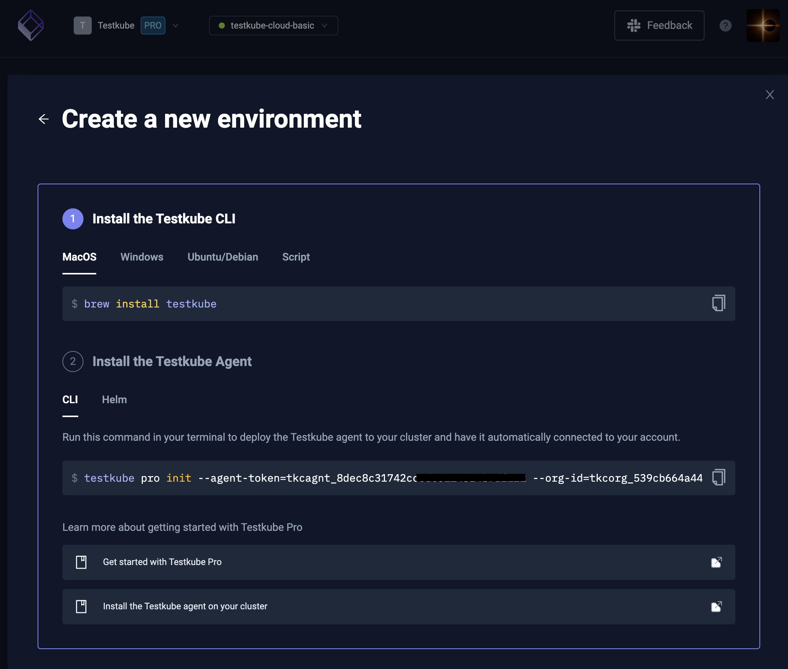

# Multicluster

Testkube can federate multiple clusters. Conceptually, each cluster maps to an Environment within Testkube.

:::info
The commands below that connect to on-prem will likely need to add
an `--agent-uri` flag or they will instead by default connect to Testkube Cloud.
:::

## Deploy an agent that will join Testkube

You can add another agent to an existing Testkube deployment within a couple of minutes. 
Get started by going to the Dashboard and [creating a new Environment](/testkube-pro/articles/environment-management#creating-a-new-environment), which
will provide you with the command to deploy the corresponding Testkube Agent:



#### Multiple agents within the same cluster

It's possible to install multiple agents within the same cluster. This requires modified values for the second agent to prevent creating cluster-wide objects twice which is disallowed by Kubernetes. Make the following changes to the values of **the second agent**:

```yaml {2}
testkube-operator:
  enabled: false
```

## Deploy a control plane without an agent

By default, Testkube will create an environment within the same namespace as the control plane.
You can choose for a minimal deployment without a control plane.
Once started, you can [deploy agents that will join your control plane as described above][deploy-agent].

Within the Helm values.yaml make the following changes:

```diff
testkube-agent:
-  enabled: true
+  enabled: false

testkube-cloud-api:
  api:
    features:
-      bootstrapEnv: "my-first-environment"
-      bootstrapAgentTokenSecretRef: "testkube-default-agent-token"
```

[deploy-agent]: /articles/install/multi-cluster#deploy-an-agent-that-will-join-testkube
[contact]: https://testkube.io/contact
[cli-context]: /testkube-pro/articles/managing-cli-context
