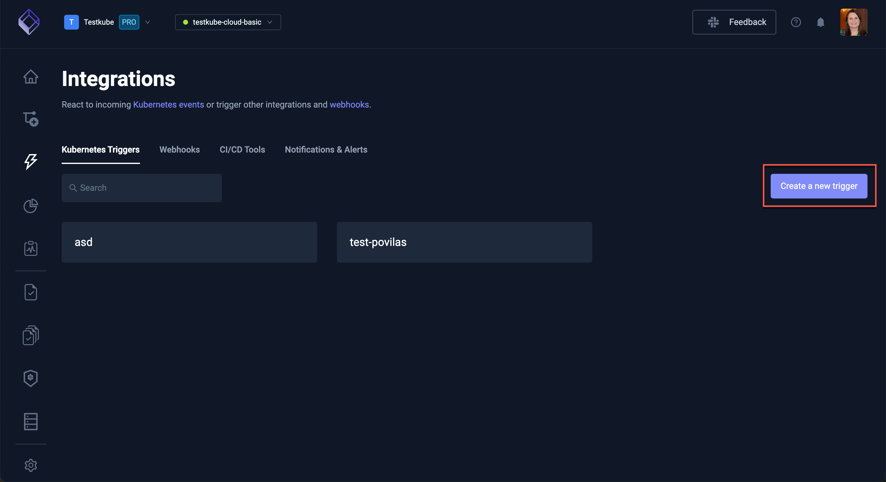
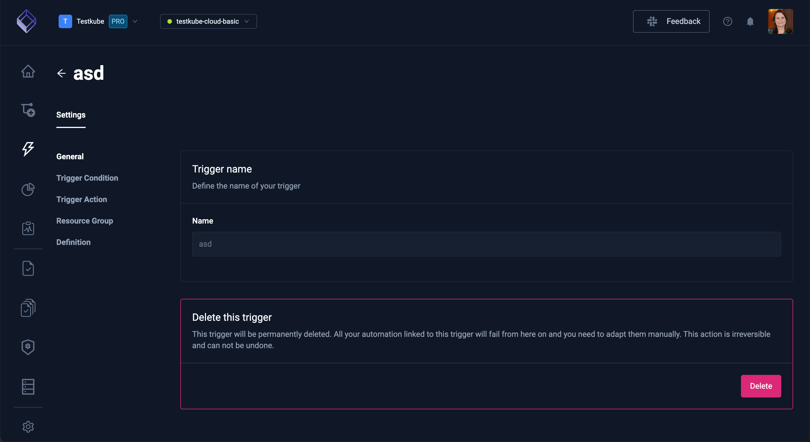
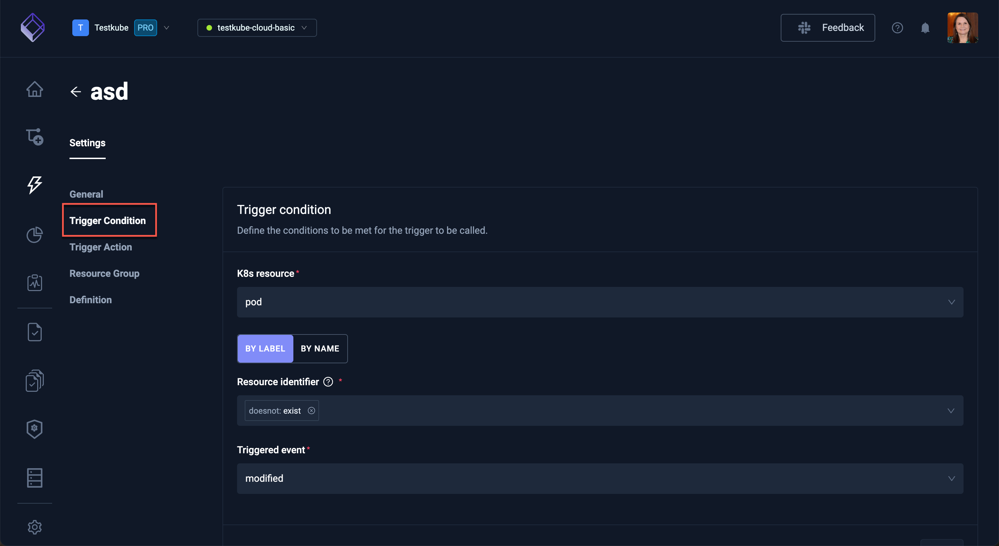
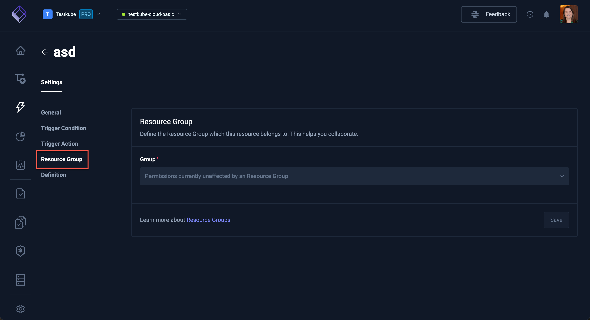
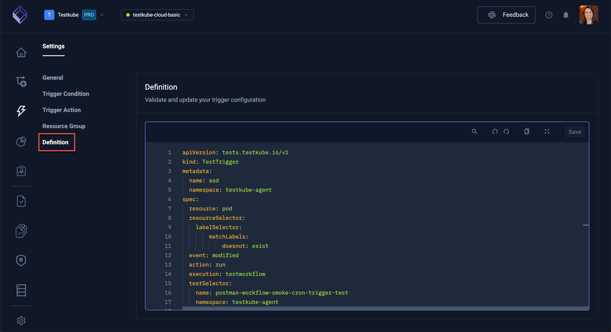

# Kubernetes Triggers

The Testkube Dashboard allows you to create and manage the Kubernetes Triggers available in your 
Environments.

:::tip
Check out the [Kubernetes Event Triggers](/articles/test-triggers) document to learn how Event Triggers work
in Testkube. 
:::

Triggers are defined at the Environment level and are managed from the "Kubernetes Triggers" tab in the Integrations 
panel: 

You will see the list of currently available triggers. Select one of these to review, update or delete.

## Creating a New Trigger

Select the **Create a new trigger** button to create a new Kubernetes Trigger:

:::tip
The wizard to create a Trigger only exposes basic Trigger configurations, for more advanced [condition and action
configuration](/articles/test-triggers#custom-resource-definition-model) you can modify the generated YAML directly in the 
[Definition tab](/articles/integrations-triggers#definition) for your Trigger. 
:::

### New Trigger Condition

You will initially be prompted for

- the **Name** of the trigger - must be a valid Kubernetes name as Triggers are stored as CRDs in your cluster.
- the **K8s Resource** kind to monitor for events
- the **Resources Identifier** for which resources to monitor, can either be a list of Kubernetes Labels or a specific resource name.
- the **Triggered event** to listen for.

### New Trigger Action

Once the condition has been specified you need to specified what action to take when the trigger occurs:

- select the **Testkube action** to perform.
- select the target **Testkube Resource** for the action, either by Labels or by Name.

## Trigger Settings

Selecting a Trigger from the list of Triggers shows its Settings.

:::note
As with the wizard above to create a Trigger, the Settings tab only expose basic rigger configurations, for more 
advanced [condition and action configuration](/articles/test-triggers#custom-resource-definition-model) you can modify the 
generated YAML directly in the [Definition tab](/articles/integrations-triggers#definition) for your Trigger.
:::

### General

The **General** tab allows you to modify the name of the Trigger and delete it if needed.

### Trigger Condition

**Trigger Condition** allows you to configure the conditions to be met for the current trigger to be called.

### Trigger Action

**Trigger Action** allows you to configure the action to be performed in Testkube once the conditions are met.

### Resource Group

**Resource Group** defines the Resource Group this resource belongs to - [Read More about Resource Groups](/articles/resource-groups)

### Definition

**Definition** shows the underlying YAML for your Trigger, allowing you to manually configure your Trigger vs using the
previous tabs.

:::tip
As mentioned above, Triggers are stored as CRDs in your cluster - [Read More about the Trigger CRD](/articles/test-triggers#custom-resource-definition-model) 
:::
