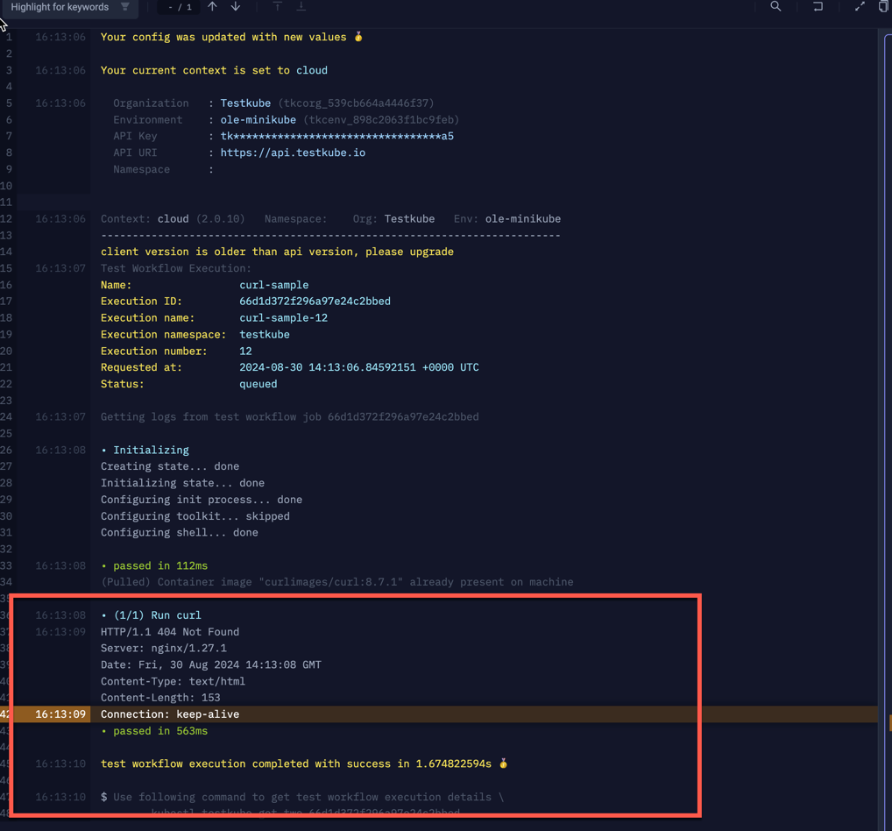
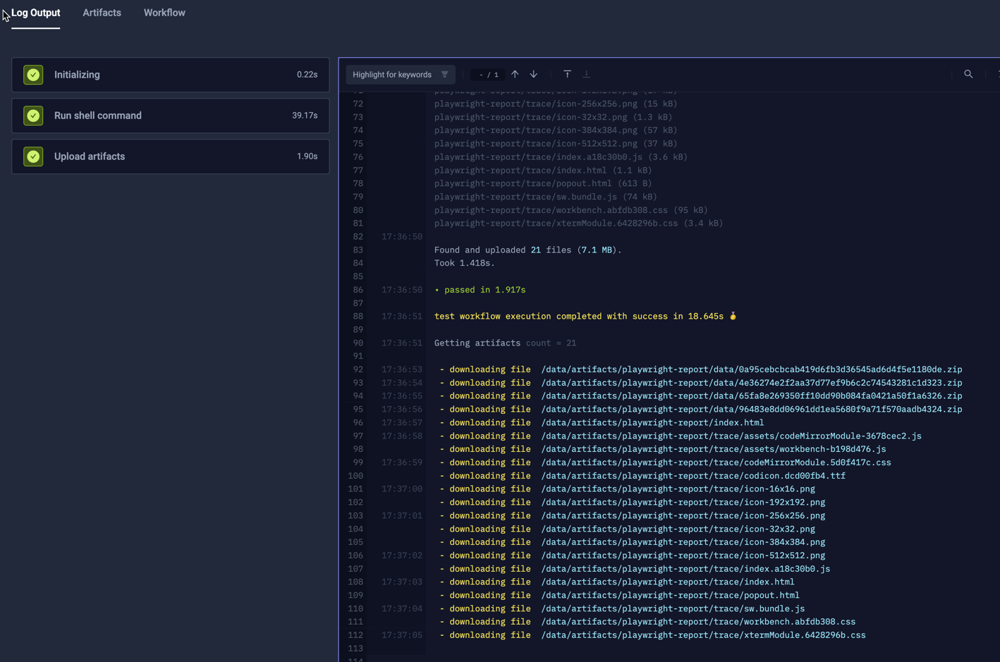
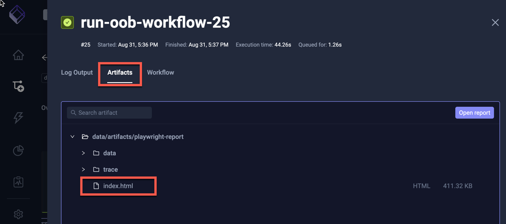

# Remote Workflow Execution

In a complex Testkube installation it might be desirable to schedule and synchronize the execution 
of Workflows across multiple Environments. Let's look at how Test Workflows can use 
the Testkube CLI to achieve this.

## Using the CLI to trigger remote Workflows

You can automate the Testkube CLI in your Test Workflows to trigger the execution of a Workflow in another 
Environment and collect its results - allowing you to potentially aggregate executions and results from multiple
environments in a single "Controller Environment".

To trigger a Workflow in another Environment using the Testkube CLI we need at least the following:

- `apiToken` - an API Token generated for the remote Environment under its containing Organization - [Read More](/testkube-pro/articles/api-token-management).
- `environmentId` - the Testkube ID of the target Environment.
- `organizationId` - the Testkube ID of the organization containing the target Environment.
- `rootDomain` - the domain where the Testkube Control Plane is running - this will be `testkube.io` when using Testkube Cloud.
- `workflowName` - the name of the target workflow to run.

Below is an example Workflow that defines all the above as configuration parameters.

```yaml
kind: TestWorkflow
apiVersion: testworkflows.testkube.io/v1
metadata:
  name: run-remote-workflow
  namespace: testkube
spec:
  config:
    apiToken:
      type: string
      default: tkcapi_XX
    environmentId:
      type: string
      default: tkcenv_XX
    organizationId:
      type: string
      default: tkcorg_XX
    rootDomain:
      type: string
      default: testkube.io
    workflowToRun:
      type: string
  steps:
  - run:
      image: kubeshop/testkube-cli:latest
      shell: |
        testkube set context \
          --api-key {{ shellquote(config.apiToken) }} \
          --root-domain {{ shellquote(config.rootDomain) }} \
          --org-id {{ shellquote(config.organizationId) }} \
          --env-id {{ shellquote(config.environmentId) }}

        testkube run tw {{ shellquote(config.workflowToRun) }} -f
status: {}
```

:::tip
Check out all available `testkube run tw` parameters in the [CLI Reference](/cli/testkube_run_testworkflow).
:::

### Passing Configuration Parameters

If the target Workflow accepts configuration parameters, we can add these to the `testkube run tw` command with the `--config`
parameter, for example if the Workflow triggered in the example above requires a name parameter, this would be specified
as follows:

```shell
testkube run tw {{ shellquote(config.workflowToRun) }} -f --config name=SomeName
```

### Log Output from Remote Workflows

The `-f` parameter specified in the example above will wait for the target Workflow to finish and capture its log output
to stdout, allowing you to see and analyse the remote execution log from the calling Workflow logs. For example the
below output for the above Workflow was generated when calling a target Workflow that runs a simple CURL command:



The highlighted section is the actual CURL output, everything above that is related to the `testkube set context` command
and the subsequent call to `testkube run tw`.

### Artifacts from Remote Workflows

If the target Workflow generates artifacts, we can modify the shell command above as follows:

```yaml
...
      shell: |
        testkube set context \
          --api-key {{ shellquote(config.apiToken) }} \
          --root-domain {{ shellquote(config.rootDomain) }} \
          --org-id {{ shellquote(config.organizationId) }} \
          --env-id {{ shellquote(config.environmentId) }}

        mkdir /data/artifacts
        testkube run tw {{ shellquote(config.workflowToRun) }} -f -d --download-dir /data/artifacts 
      artifacts:  
        paths:
        - /data/artifacts/**/*
```

The following changes were made:
- a `mkdir /data/artifacts` command to create a folder for artifacts.
- additional `-d --download-dir /data/artifacts` arguments to the `testkube run tw` command.
- an `artifacts` property telling Testkube where to find the downloaded artifacts [Learn More](/articles/test-workflows-artifacts).

The following example output is from a remote Playwright test that was configured to generate both reports and traces:



These artifacts are now available for viewing under the Artifacts Tab:



## Synchronized Multi-Enviroment Execution

It can sometimes be desirable to coordinate the execution of Workflows across multiple Testkube Environments, for example
if you want to synchronize tests to run from different geographical locations against an external target, or if you
want to validate application functionality/access from both inside and outside the cluster the application is running in.

Combining the above with the approach described in [Test Suites](/articles/test-workflows-test-suites) allows
you to do this with Testkube; simply create a dedicated Workflow that uses `execute` to trigger both remote and local
Workflows as desired.

```yaml
kind: TestWorkflow
apiVersion: testworkflows.testkube.io/v1
metadata:
  name: multi-environment-e2e-test
spec:
  steps:
  - execute:
      workflows:
      - name: e2e-test
        config:
          targetUrl: <internal-hostname>
      - name: run-remote-workflow
        config:
          apiToken: tkcapi_XXXX
          environmentId: tkcenv_XXXX
          organizationId: tkcorg_XXXX
          targetUrl: <external-hostname>
          workflowToRun: basic-load
      - name: run-remote-workflow
        config:
          apiToken: tkcapi_YYYY
          environmentId: tkcenv_YYYY
          organizationId: tkcorg_YYYY
          targetUrl: <external-hostname>
          workflowToRun: basic-load
```

The above example executes

- a local `e2e-test` Workflow that runs an end-to-end test against an application to be tested.
- two `basic-load` tests in separate Testkube Environments, each putting load on the same application to be tested.

The purpose of this specific setup is to validate that our application is fully functional when under load from two
external sources, but you could for example create similar scenarios where multiple tests are combined both 
in sequence and in parallel to ensure that your target applications and services perform in line with their requirements
under complex usage scenarios.

 
