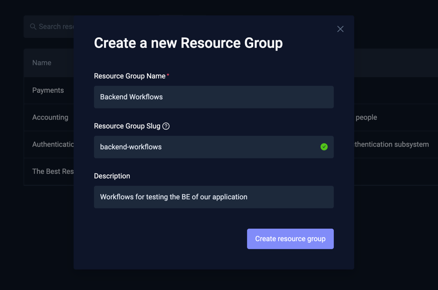
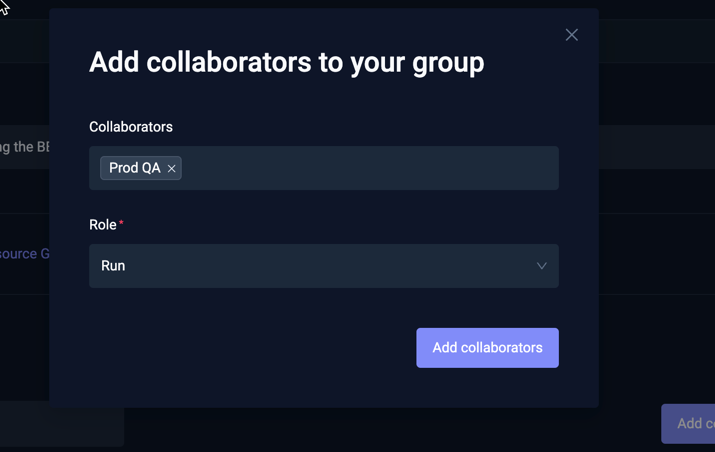
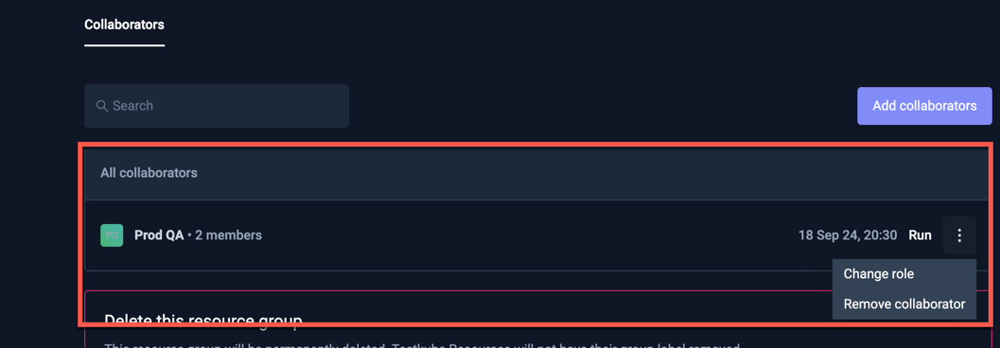
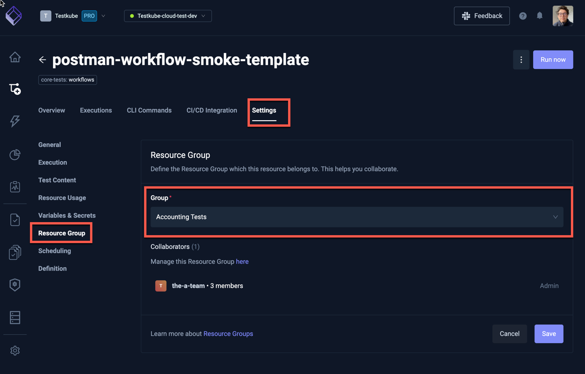
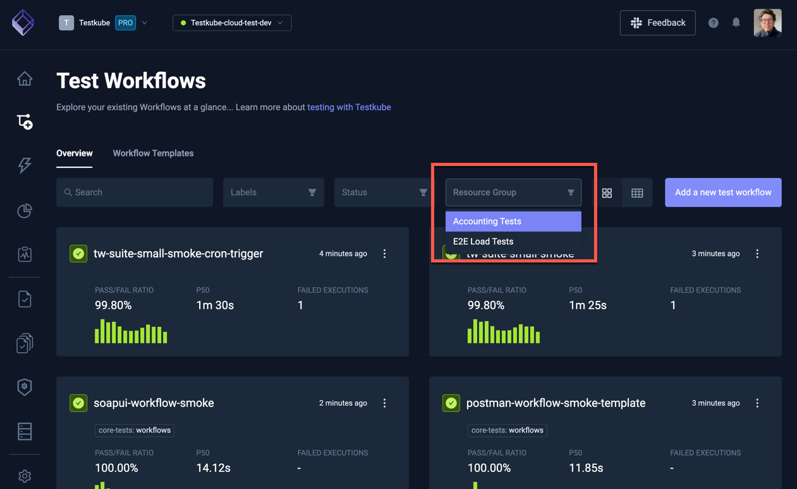

# Resource Groups

Resource Groups allow you to group resources across all your Environments, by whatever criteria meets your needs 
(team, application, component, etc.). Once defined, you can assign individual members or teams to a Resource Group 
with a specific Role, resulting in those members having corresponding permissions for the resources in that Resource
Group.

The following types of Testkube Resources can currently be added to a Resource Group:

- Workflows - from the "Resource Group" Tab under [Workflow Settings](/articles/testkube-dashboard-workflow-details#workflow-settings-tabs)
- Workflow Templates - from the "Resource Group" Tab under [Workflow Template Settings](/articles/testkube-dashboard-workflows-templates#workflow-template-settings)
- Triggers - from the "Resource Group" Tab under Trigger Settings - [Read More](/articles/test-triggers)  
- Webhooks - from the "Resource Group" Tab under Webhook Settings - [Read More](/articles/webhooks)

:::info
Please read [Resource Access Management](/articles/resource-access-management) to get an overview of how Testkube
allows you to manage and apply Resource Access controls.
:::

Selecting "Resource groups" from the Organization Management panel shows a list of all existing Resource Groups:

## Creating a new Resource Group

Select the [Create a new group] button in the overview above, you will be prompted for the name, 
slug and description (The slug is a human-friendly identifier used in URLs):

## Resource Group Settings

Selecting an existing Resource Group or creating a new one takes you to the Resource Group Settings page, which
allows you to configure the name, description and Collaborators for the Resource Group (the slug cannot be changed).
There is also an option to delete the Resource Group at the bottom.

## Managing Resource Group Collaborators

Add collaborators to a Resource Group with the "Add collaborators" button, which will prompt for 
which Members and/or Teams to add as collaborators, and which Role they should have for this Resource Group

Once added, you can manage Members in the list at the bottom of this page, use the menu on the right to
change their Role or remove them:

## Managing Resources in a Resource Group

Adding or removing a Testkube resource to/from a Resource Group is done from that Resources' Settings page. For 
example, to assign a Workflow to a Resource Group, go to the "Resource Group" Tab of the Workflow Settings and select
which Resource Group the Workflow belongs to ("Accounting Tests" in the below screenshot).

## Listing Resources in a Resource Group

There is currently no single view that shows all resources in a Resource Group, but you can filter both 
Workflows and Workflow Templates on a Resource Group in the Workflows Overview:

