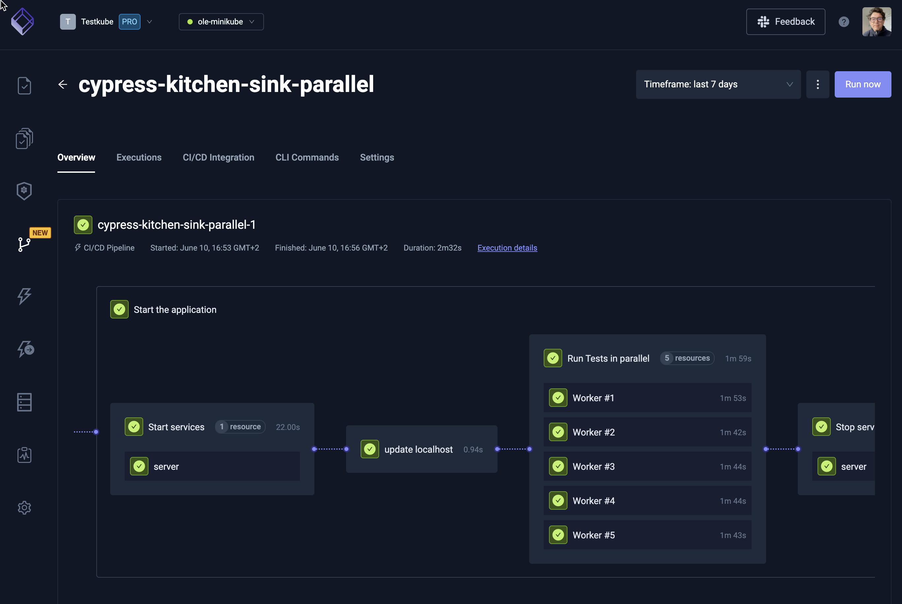

# Running and Scaling Tests

## Scale 

The actual scaling of test executions is done using corresponding infrastructure either provided by your CI/CD tooling or yourself (or a combination thereof..). Depending on the complexity of your teams and testing activities, this will require you to ensure that your infrastructure has the capacity and resilience to run:

- Multiple tests triggered separately in parallel, if multiple teams/components are building at the same time.
- The same test at scale. For example, if you’re scaling out a load-test to generate massive load, or scaling out an E2E test to run against multiple browsers at the same time.
- Collision: avoid that tests impact each other (load or state) in regard to shared resources (unless you want them to..). 

From a security perspective, executing your tests will require that your tests have network/component access to the components/applications being tested, which could impose a challenge if tests are run from “outside” the infrastructure where the target applications are running.

## Running Tests with Testkube

Testkube leverages Kubernetes to run your tests, resulting in several run-time benefits:
- Scaling test execution to any number of individual tests executing in parallel is managed by the Kubernetes job scheduler, ensuring efficient resource allocation and test execution (provided that Kubernetes has sufficient resources itself).
- Scaling the same test for the sake of generating massive load or running multiple permutations in parallel is managed automatically by Testkube in concert with underlying Kubernetes scheduling.
- Since tests run inside your clusters, you generally don’t need to give external network access to your testing tools, ensuring that tests are run both securely and aligned with the configuration of a production environment.

Read on about [Troubleshooting Tests](../articles/troubleshooting-tests.md).