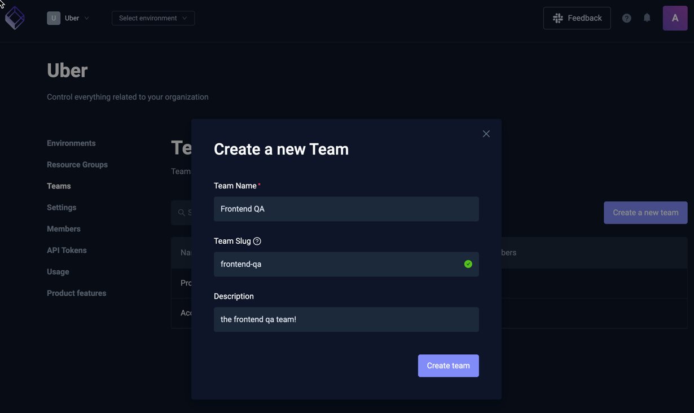
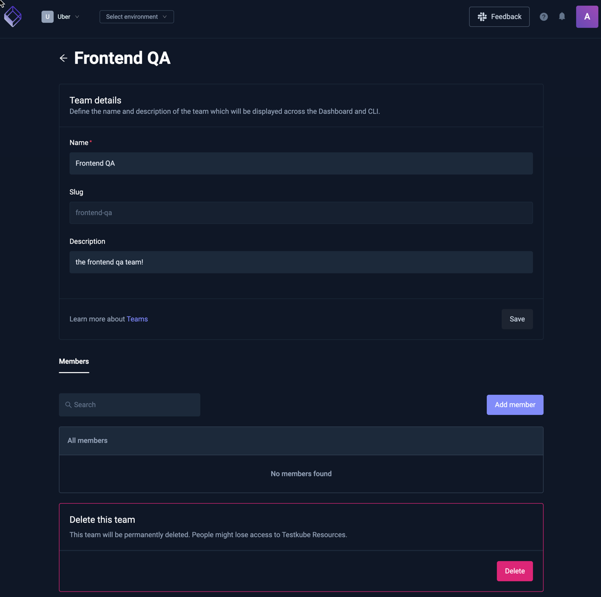
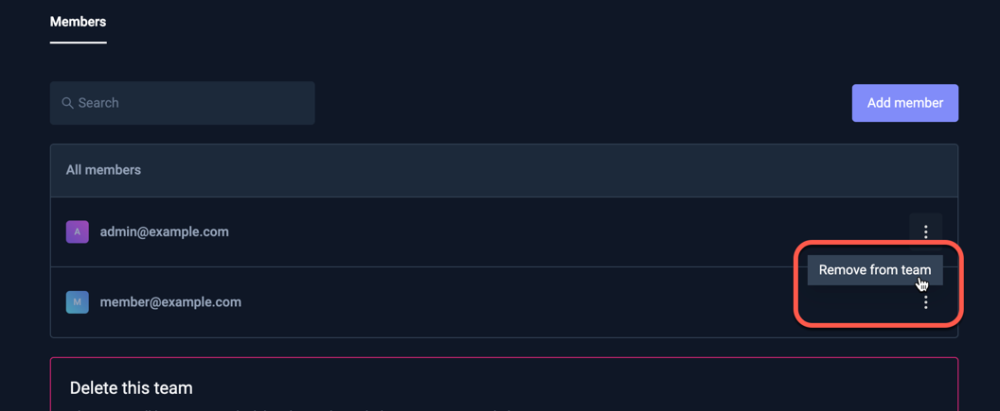

# Testkube Teams

Testkube Teams allow you to group Organization members into Teams that can then be assigned to either
[Environments](/testkube-pro/articles/environment-management#environment-members) or [Resource Groups](/articles/resource-groups) with a specific Role.

:::info
Please read [Resource Access Management](/articles/resource-access-management) to get an overview of how Testkube
allows you to manage and apply Resource Access controls.
:::

Selecting "Teams" from the Organization Management panel shows a list of all existing teams:

## Creating a new Team

Select the [Create a new team] button in the overview above, you will be prompted for the name, slug and description
(The slug is a human-friendly identifier used in URLs):

## Team Settings

Selecting an existing team or creating a new one takes you to the Team Settings page which allows you to configure
the name, description, and Team Members (the slug cannot be changed). There is also an option to delete the Team at 
the bottom.

## Managing Team Members

Use the [Add member] button to add one or more members to a team. Added members will show up in the list of
members and can be removed using the popup menu on the right of each member:

