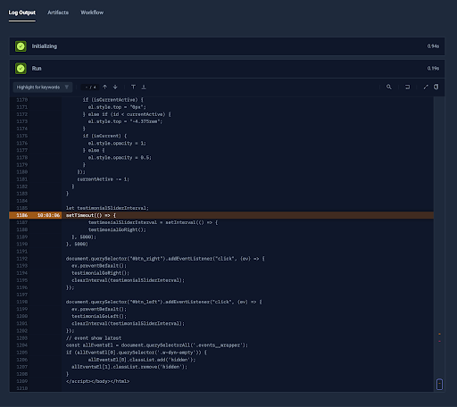
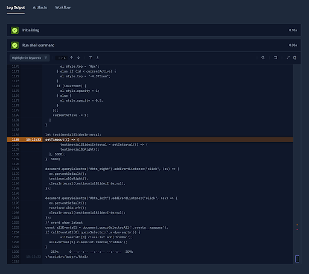
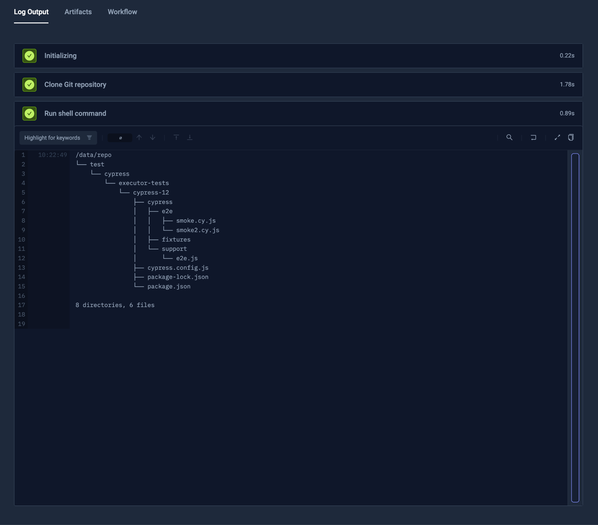
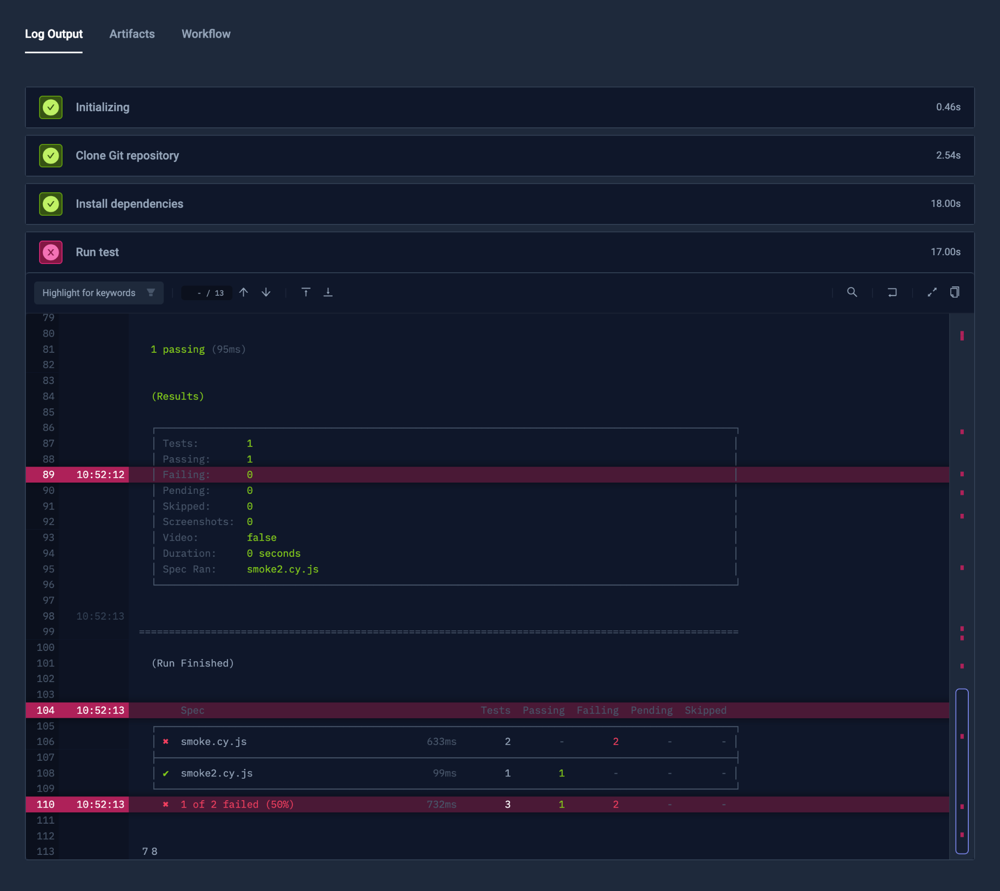
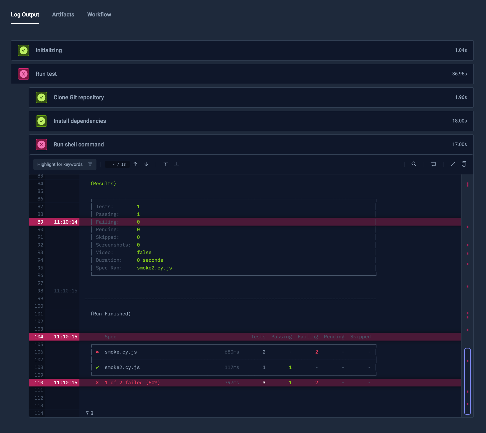
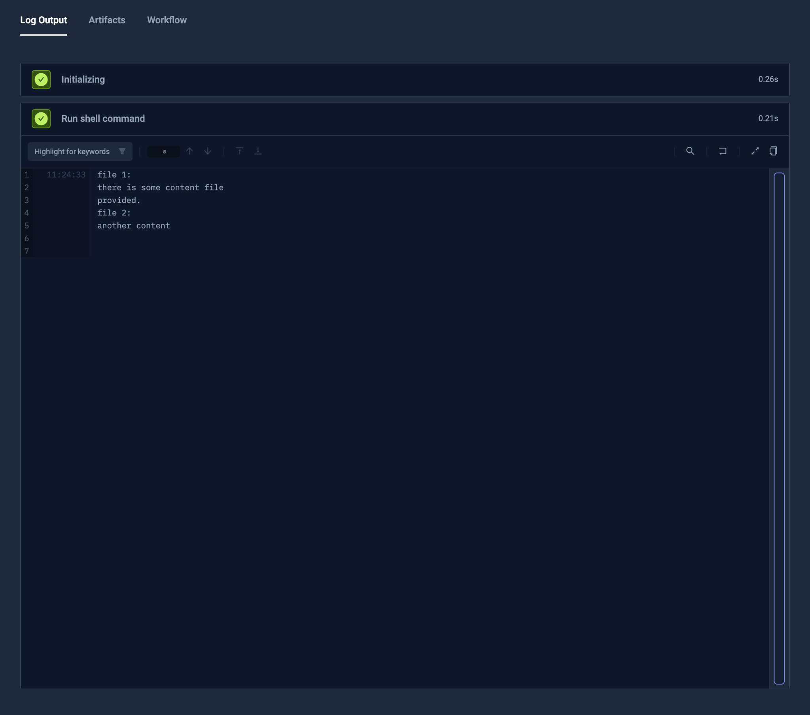
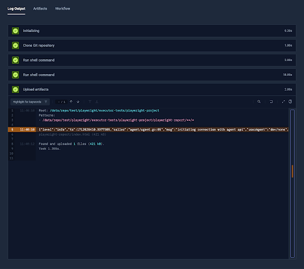
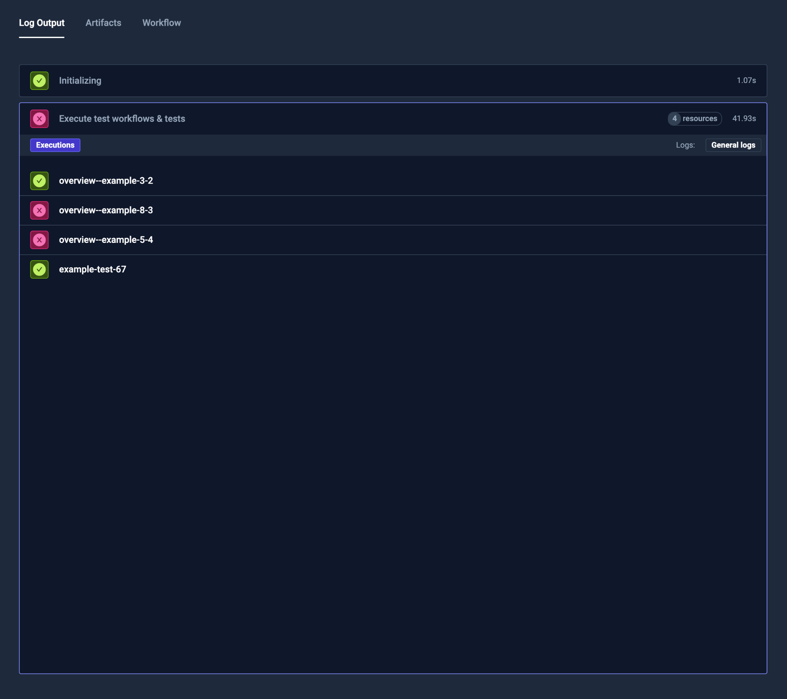

# Test Workflows Examples - Basics

:::tip
The [Schema Reference for Test Workflows](/articles/crds/testworkflows.testkube.io-v1#testworkflow) describes all available properties and constructs
:::

## Running the Image

The Test Workflows spec allows you to provide instructions in setup, steps and after properties.

### Syntax

Both setup, steps and after have the same syntax - they are a list of steps. The step is an object that has execution instructions.

```yaml
apiVersion: testworkflows.testkube.io/v1
kind: TestWorkflow
metadata:
  name: overview--example-1
spec:
  steps:
    - run:
        image: "curlimages/curl:7.78.0"
        args:
          - "https://testkube.io"
```

### Running the Image

Use a run instruction that has similar syntax to the native Kubernetes’ container. A command exiting with code > 0 is considered a failure.



## Using Shell

### Running Shell Commands

For simplicity, you can also run shell commands with the **run** instruction and the **shell** property.
The script is automatically prepended with **set -e**, so, by default, it will fail the step on any error.

```yaml
apiVersion: testworkflows.testkube.io/v1
kind: TestWorkflow
metadata:
  name: overview--example-2
spec:
  steps:
    - run:
        image: "curlimages/curl:7.78.0"
        shell: |
          curl https://testkube.io
```

### Alternative Syntax

Alternatively, you can use **shell** directly as an instruction and a default image will be used.



## Fetching the Git Repository

### Fetching Data from Git

To fetch data from the Git, use the git property of content. You may provide the address, revision (commit, branch or tag), along with i.e. token.

To avoid fetching all files in mono-repository, you can use paths for sparse checkout.

```yaml
apiVersion: testworkflows.testkube.io/v1
kind: TestWorkflow
metadata:
  name: overview--example-3
spec:
  content:
    git:
      uri: "https://github.com/kubeshop/testkube"
      revision: "main"
      paths:
        - "test/cypress/executor-tests/cypress-12"

  steps:
    - shell: "tree /data/repo"
```

### Mounting

By default the repository is mounted to /data/repo directory. You can control it with mountPath property though.



## Fetching a Secured Git Repository

### Using a Token from a Secret

You may provide the Git token and username either as plain-text, or via the tokenFrom and usernameFrom clauses that are the same as native Kubernetes env.\*.valueFrom.

```yaml
apiVersion: testworkflows.testkube.io/v1
kind: TestWorkflow
metadata:
  name: overview--example-4
spec:
  content:
    git:
      uri: "https://github.com/kubeshop/testkube"
      tokenFrom:
        secretKeyRef:
          name: "private-repo-secret-token"
          key: "token"

  steps:
    - shell: "tree /data/repo"
```

## Using Multiple Steps

### Running Multiple Steps

To run multiple steps, simply add another step with next instructions.

```yaml
apiVersion: testworkflows.testkube.io/v1
kind: TestWorkflow
metadata:
  name: overview--example-5
spec:
  content:
    git:
      uri: "https://github.com/kubeshop/testkube"
      revision: "main"
      paths:
        - "test/cypress/executor-tests/cypress-12"

  steps:
    - name: "Install dependencies"
      run:
        image: "cypress/included:13.6.4"
        workingDir: "/data/repo/test/cypress/executor-tests/cypress-12"
        shell: "npm install"
    - name: "Run test"
      run:
        image: "cypress/included:13.6.4"
        workingDir: "/data/repo/test/cypress/executor-tests/cypress-12"
        shell: "cypress run"
```


## Container Defaults

### Setting Up Defaults

To configure default container settings, you may use the container property.
It has a similar syntax to the Kubernetes’ native [Container](https://kubernetes.io/docs/reference/generated/kubernetes-api/v1.23/#container-v1-core) spec.

```yaml
apiVersion: testworkflows.testkube.io/v1
kind: TestWorkflow
metadata:
  name: overview--example-6b
spec:
  content:
    git:
      uri: "https://github.com/kubeshop/testkube"
      revision: "main"
      paths:
        - "test/cypress/executor-tests/cypress-12"

  container:
    image: "cypress/included:13.6.4"
    workingDir: "/data/repo/test/cypress/executor-tests/cypress-12"
    resources:
      requests:
        memory: "2Gi"
        cpu: 2

  steps:
    - name: "Install dependencies"
      shell: "npm install"
    - name: "Run test"
      shell: "cypress run"
```

### Notable Nuances

Thanks to the container and run instructions being similar to native Kubernetes’ container specs, you can easily set the required resources for running.



## Step Isolation

### Nested Steps

You can also pass nested setup steps in the step list.

```yaml
apiVersion: testworkflows.testkube.io/v1
kind: TestWorkflow
metadata:
  name: overview--example-7
spec:
  steps:
    - name: "Run test"
      content:
        git:
          uri: "https://github.com/kubeshop/testkube"
          revision: "main"
          paths:
            - "test/cypress/executor-tests/cypress-12"
      container:
        image: "cypress/included:13.6.4"
        workingDir: "/data/repo/test/cypress/executor-tests/cypress-12"
      steps:
        - name: "Install dependencies"
          shell: "npm install"
        - shell: "cypress run"
```

### Content and Defaults

Defaults configured in the step will work similarly to top-level defaults but will be accessible only by the step itself and all steps inside. For example, previous and subsequent steps will not have access to mounted repositories or environment variables.



## Step Orchestration

### Optional Steps

You can add `optional: true` for the step, so that step will not effect the outcome of the orchestration.

```yaml {8}
apiVersion: testworkflows.testkube.io/v1
kind: TestWorkflow
metadata:
  name: overview--example-8
spec:
  steps:
    - name: "Step 1"
      optional: true
      shell: exit 1
    - name: "Step 2"
      negative: true
      shell: exit 1
    - name: "Step 3"
      negative: true
      shell: exit 0
    - name: "Step 4"
      shell: echo hello
    - name: "Step 5"
      condition: always
      retry:
        count: 3
      shell: echo foo; exit 1
```

### Conditional Steps

By default, the next step will run only when the previous steps have succeeded. This can be controlled with the **condition** property.

As an example, **condition: always** will cause the step to always be executed, even if the previous step has failed.

### Retry Mechanism

It’s possible to automatically retry the step on a failure (or any other condition).


## Content Files

### Provide Static Files

A part of the Git repository and regular commands, the Test Workflow can use some static files directly from the spec.

These files are mounted from a ConfigMap automatically (unless, instead of content, there is **contentFrom** used with a similar schema as Kubernetes’ **env.\*.valueFrom**).

_When the path is relative, it will be mounted in the container’s working directory._

```yaml
apiVersion: testworkflows.testkube.io/v1
kind: TestWorkflow
metadata:
  name: overview--example-9
spec:
  content:
    files:
      - path: /some/path
        content: |
          there is some content file
          provided.
      - path: another-file.txt
        content: |
          another content
  steps:
    - workingDir: /foo/bar
      shell: |
        echo "file 1:"
        cat /some/path
        echo "file 2:"
        cat another-file.txt
```



## Artifacts

### Saving the Artifacts

Saving the artifacts is as simple as defining the artifacts instruction and providing the file masks to fetch. There is no need to create additional volumes, the artifacts step has access to all the files.

```yaml
apiVersion: testworkflows.testkube.io/v1
kind: TestWorkflow
metadata:
  name: overview--example-10
spec:
  content:
    git:
      uri: "https://github.com/kubeshop/testkube"
      paths:
        - "test/playwright/executor-tests/playwright-project"

  container:
    image: "mcr.microsoft.com/playwright:v1.32.3"
    workingDir: "/data/repo/test/playwright/executor-tests/playwright-project"
    resources:
      requests:
        memory: "2Gi"
        cpu: 2

  steps:
    - shell: "npm ci"
    - shell: "npx playwright test --workers 2 --reporter html"
    - condition: always
      artifacts:
        paths:
          - "playwright-report/**/*"
```



## Test Suite Like Runs

### Run Dependent Test Workflows or Tests

To run other Test Workflows or Tests, you can use the **execute** instruction.

You can define the number of concurrent executions with **parallelism** as well.

```yaml
apiVersion: testworkflows.testkube.io/v1
kind: TestWorkflow
metadata:
  name: overview--example-11
spec:
  steps:
    - execute:
        tests:
          - name: "example-test"
        workflows:
          - name: "overview--example-3"
          - name: "overview--example-5"
          - name: "overview--example-8"
```



## Job/Pod Configuration

### Configuring the Job

By using the **job** property, you can configure labels, annotations and execution namespace of the Job.
In case of supplying namespace you will need to setup execution namespaces in your helm chart values. It's possible to generate all required RBAC or just manually supply them.

```yaml
apiVersion: testworkflows.testkube.io/v1
kind: TestWorkflow
metadata:
  name: overview--example-12
spec:
  job:
    labels:
      job-label: "foobar"
    annotations:
      this.is.important: false
    namespace: "default"
```

### Configuring the Pod

By using the **pod** property, you can configure labels, annotations, serviceAccountName, imagePullSecrets, volumes, or other properties of a [PodSpec](https://kubernetes.io/docs/reference/generated/kubernetes-api/v1.23/#podspec-v1-core).

```yaml
apiVersion: testworkflows.testkube.io/v1
kind: TestWorkflow
metadata:
  name: overview--example-13
spec:
  job:
    labels:
      job-label: "foobar"
  pod:
    labels:
      pod-label: "barfoo"
    serviceAccountName: "testkube-api-server"
    imagePullSecrets:
      - name: "dockerhub-secret"
```

## Filtering Test Workflow Executions using Tags

This example demonstrates how to use execution tags in your test workflows to easily filter and view executions.

### Example Workflow

```yaml
kind: TestWorkflow
apiVersion: testworkflows.testkube.io/v1
metadata:
  name: execution-tags-sample
  namespace: testkube-agent
  labels:
    docs: example
spec:
  config:
    serviceUnderTest:
      type: string
      default: local-service-under-test
    targetUrl:
      type: string
      default: https://testkube.io
  execution:
    tags:
      service: '{{config.serviceUnderTest}}'
      url: '{{config.targetUrl}}'
  steps:
  - name: Run curl
    container:
      image: curlimages/curl:8.7.1
    shell: curl -s -I {{ config.targetUrl }}
```

### How It Works

1. The workflow defines two configuration variables: `serviceUnderTest` and `targetUrl`.
2. These variables are used to set execution tags:

   - `service`: Set to the value of `serviceUnderTest`
   - `url`: Set to the value of `targetUrl`


3. Each execution of this workflow will be tagged with these values.
4. Importantly, you can change the config values on each run, allowing you to use the same workflow definition for testing different services and URLs.
   
### Using Tags for Filtering

You can run this workflow multiple times with different values for `serviceUnderTest` and `targetUrl`. For example:

1. `testkube-docs` and its corresponding URL
2. `testkube-app` and its URL
3. `testkube-web` and its URL

These tags allow you to easily filter and view executions in the Testkube UI or CLI based on the service or URL being tested.


## Additional Test Workflow Examples
Additional Test Workflow examples can be found under the [Examples and Guides](/articles/examples/overview) 
section in this documentation, and in the Testkube repository.

- [Cypress](https://github.com/kubeshop/testkube/blob/develop/test/cypress/executor-tests/crd-workflow/smoke.yaml)

- [Gradle](https://github.com/kubeshop/testkube/blob/develop/test/gradle/executor-smoke/crd-workflow/smoke.yaml)

- [JMeter](https://github.com/kubeshop/testkube/blob/develop/test/jmeter/executor-tests/crd-workflow/smoke.yaml)

- [k6](https://github.com/kubeshop/testkube/blob/develop/test/k6/executor-tests/crd-workflow/smoke.yaml)

- [Maven](https://github.com/kubeshop/testkube/blob/develop/test/maven/executor-smoke/crd-workflow/smoke.yaml)

- [Playwright](https://github.com/kubeshop/testkube/blob/develop/test/playwright/executor-tests/crd-workflow/smoke.yaml)

- [Postman](https://github.com/kubeshop/testkube/blob/develop/test/postman/executor-tests/crd-workflow/smoke.yaml)

- [SoapUI](https://github.com/kubeshop/testkube/blob/develop/test/soapui/executor-smoke/crd-workflow/smoke.yaml)
