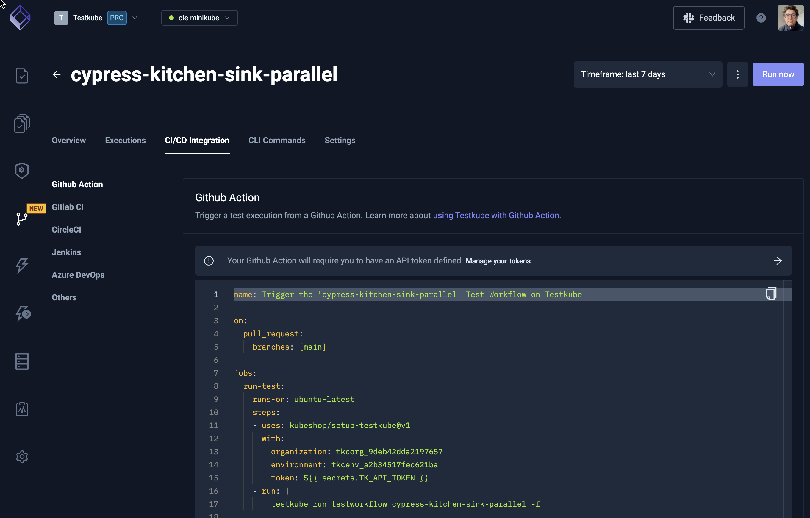

# Triggering Tests

Once your test execution has been defined, you’re tasked with triggering your tests:

- If you’ve defined them as part of a workflow/pipeline in CI/CD, your test executions will be triggered accordingly by your CI/CD solution(s).
- If you’re using a GitOps approach you might want to trigger tests after certain Kubernetes events occur in your clusters, for example, when a pod has been updated.
- If you’re running non-functional tests (load, security, compliance, etc), you might want to trigger these either manually (when your infrastructure is ready) or on a regular basis - decoupled from CI/CD - for example, run security tests on a daily basis.
- Finally, you might want to trigger any test execution manually, for example to run acceptance tests, or rerun failed automated tests to see if they are working properly after a system update, without having to run the entire CI/CD pipeline.

In reality, any combination of the above applies in most cases - both automated and manual triggering of tests is required for a successful testing process.

Triggering tests is either automated or done manually by either DevOps (for example non-functional tests) or Dev/QA as needed.

##Triggering Tests with Testkube

The decoupling of test definition and execution from your CI/CD is one of the most important and powerful aspects of Testkube, as this allows you to trigger your tests in any way needed:
- From your CI/CD workflows using one of our [CI/CD integrations](../articles/cicd-overview.md).
- In response to Kubernetes events using [Triggers](../articles/test-triggers.mdx).
- Manually via the [CLI](../articles/install/1-cli.mdx) or the [Testkube Dashboard](../articles/testkube-dashboard.md).
- At a recurring schedule using [Test Workflow Scheduling](../articles/test-workflows.md).
- From any other tool using the Testkube REST API.

