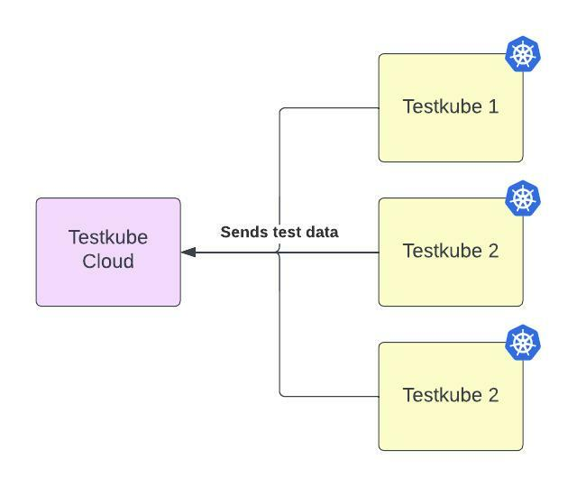

# Testkube Pro Architecture

## Multiple Testkube Agents

The main Testkube Pro feature is to have insights into multiple Testkube Pro Agents. 
You can look at your Kubernetes clusters from a single Dashboard and easily switch between different Testkube clusters. 

## Storing Results

In Testkube standalone, all results are stored in the users cluster, so you need to be aware of MinIO and MongoDB. 
Testkube Pro makes it easy for you. All data is stored in the Testkube Pro infrastructure so you don't need to worry about backups.

## Testkube Networking

To simplify networking connections, the Testkube Agent is able to create a connection to Testkube Pro clusters. The Agent is registering itself into 
Testkube Pro as a new environment. 
This allows Testkube Pro to send commands which Testkube will manage in Agent mode. The connection is established from Testkube Agent to Testkube Pro.

After installation, the Testkube Agent connects to Testkube Pro and starts listening for commands. 
Additionally the Agent is connecting to the Testkube Pro REST API.

Testkube Agent is connecting to `https://api.testkube.io` on port `8088` for HTTPS connection and on port `8089` for GRPC connection.  

