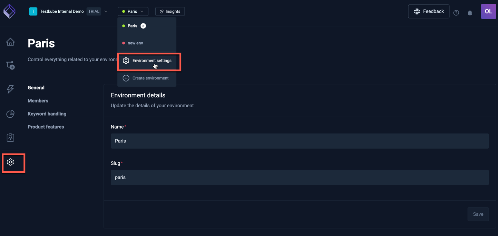
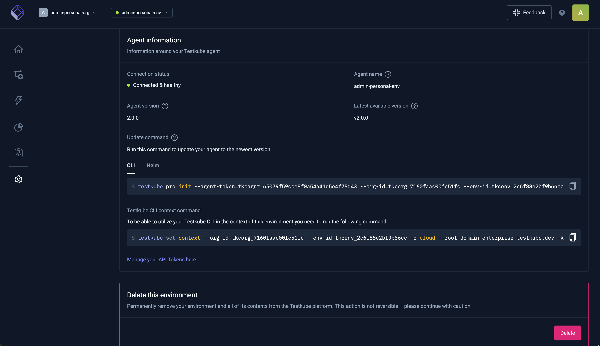

# Environment Management

An environment is a grouping Workflows, Execution Results, Triggers and Webhooks.

:::info
A Testkube environment is managed by a Testkube Agent running in your Kubernetes Cluster - read more [here](../articles/architecture.md).
:::

## Creating a New Environment

You can create a new environment from the "Environments" drop down in the header section of the Testkube Dashboard.

You will be prompted for a name and presented with the command to install the environments agent in your 
Kubernetes infrastructure, see [Testkube Agent Installation][installing] for more details.

## Environment Settings

You can access the settings for an existing Environment either from the same top-level menu or the corresponding
toolbar buttton on the left:

There are 4 tabs for managing your Environment.

### General

On the "General" tab, you can see environment information:

- Connection state
- Agent name
- Agent version - If a new Testkube Agent version is available, you'll be prompted to upgrade.
- Testkube CLI context command - To configure your Testkube CLI with pro context - [Read More](managing-cli-context)

You can also delete a given environment (be careful, this action can't be rolled-back!)

### Environment Members

You can assign environment-specific roles to your organisation members to control which actions a member
can perform in a specific environment. Keep in mind that all organisation `admin` users can access all environments.

To add new organization members use the "Members" tab and select "organization members" under the "Add collaborators" section.

You can choose from one of the following roles for a member:

- `Read`: Has Read access only to all entities in an environment, test results, artifacts, logs, etc...
- `Run`: Has Read access and can trigger executions.
- `Write`: Has Run access and can make changes to environment tests, triggers, webhooks, etc...
- `Admin`: Has Write access and is allowed to invite and change other collaborator roles.

### Keyword Handling

This tab allows you to manage the Filtering categories available for [Log Highlighting](/testkube-pro/articles/log-highlighting)

There are 4 default categories, represented with a few keywords each:

| Category                   | Keywords                                                            |
|----------------------------|---------------------------------------------------------------------|
| **Error Keywords**         | Error, Exception, Fail, Critical, Fatal                             |
| **Connection**             | Connection, Disconnect, Lost, Timeout, Refused, Handshake, Retrying |
| **Resource Issues**        | OutOfMemory, MemoryLeak, ResourceExhausted, LimitExceeded, Quota    |
| **Access & Authorization** | Denied, Unauthorized, Forbidden, Invalid, Invalid Token, Expired    |

You can add/edit/remove categories using the corresponding actions in the interface.

### Product Features

There is currently only one product feature that can be toggled on or off; Legacy Test Support - [Read More](/articles/legacy-features)

[installing]: ../../articles/install/multi-cluster.md
