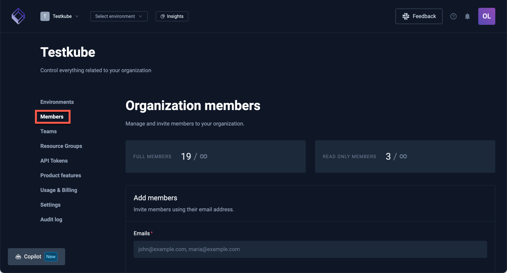
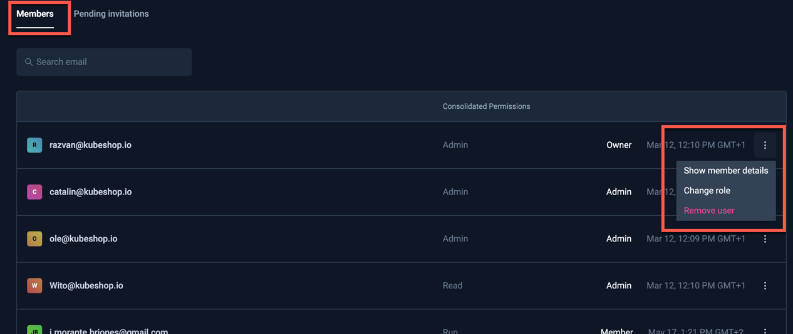

# Member Management

Manage your organization members from the [Members] option in the Organization management panel:

:::note
This document describes high-level member management within an Organization, please 
check out [Resource Access Management](/articles/resource-access-management) to get an overview of how Testkube
allows you to manage and apply Resource Access controls for Organization Members.
:::

## Member Types

Testkube allows you to license for two type types of members; **full** and **read-only**. A members' type 
is implicit and based on if that member has been given write-access to any resource/environment in Testkube: 
- A member that has been given write-access automatically counts as a full member.
- A member that does not have any write-access counts as read-only.

You can see the number of used/available seats of each type in the members page:

### Rules / Constraints 

This model imposes some constraints related to member types and permissions:

- It is not possible to give an existing read-only member write-access to any resource or environment, 
  either directly or indirectly, if no full-member seats are available.
- When giving a read-only member write access to any resource or environment, and full-member seats are available, 
  that member will automatically count to the full member quota instead.
- It is not possible to invite a user (or accept an invitation) if all member seats are occupied. 
- For on-prem/SSO-enabled deployments, new users will not be able to sign in if no seats are available.
- Members who are read-only will count to the full-member limit if there aren't enough read-only seats available.

### Member licensing with the Testkube Cloud Control Plane

When using the Testkube Cloud Control Plane instead of hosting the Control Plane on-prem, members can be
licensed either within a fixed limit, or based on active member count at the end of each month.

- **Fixed** members licensing allocates a fixed number of full and read-only members to your organization, for which
  you will be billed in your billing cycle.
- **Pay-as-you-go** member licensing counts the number of active (logged in) members at the end of each 
  billing cycle and bills you for that number of members. Pay-as-you-go licensing always invoices all members as full
  members even if there might a certain number of read-only members at a given point in time. Pay-as-you-go licensing
  is indicated by an infinity-sign in the number of members count:

:::info
Cloud Control Plane Trials have a 3 full and 5 read-only member limit by default.
:::

## Inviting Members

Invite new members from the Members page by specifying: 
- Emails - a comma-separated list of emails to invite.
- Role - there are 4 roles for organization members:
  - `Owner` - Has access to all environments and organization settings, also can access billing details.
  - `Admin` - Has access to all environments and organization settings.
  - `Member` - Access to Resource Groups and Environments is defined by the roles assigned to given member. 
  - `Biller` - Has access to billing details only.
- Teams - which Teams the invited members should belong to.
- Environments - which Environments the invited members should be added to, with their corresponding Environment Role

:::note
A new member will not have access to any resources or environments and will initially count as a read-only
member (see above) unless default permissions have been assigned via [SCIM](/testkube-pro-on-prem/articles/scim) 
or [bootstrap member mapping](/articles/install/advanced-install#bootstrap-member-mapping). 

See [Resource Access Management](/articles/resource-access-management) to learn how to give members access to 
environments and resources.
::::

Once all specified, select the Invite button in the bottom right.

:::tip
For Testkube On-Prem deployments you can configure default organizations, environments and roles for users - see 
[Bootstrap User Mapping](/articles/install/advanced-install#bootstrap-member-mapping).
:::

## Manage existing Members

Manage existing members in the list of members at the bottom of the tab. Use the menu to the right for 
each member to delete them or change their role.

Use the menu to the right to Update or Remove a member and view their details.

### Understanding Members' Permissions

Use the "Show Member Details" option shows the breakdown for the Members' Consolidated Permissions shown in the table:

## Manage pending Invites

Manage pending member invites in the lists at the bottom of the tab. Use the menu to the right for
each invite to update, revoke or resent the invite.

