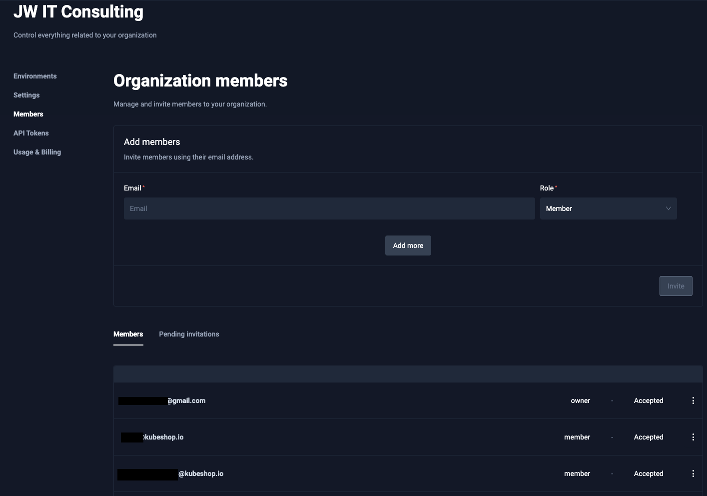
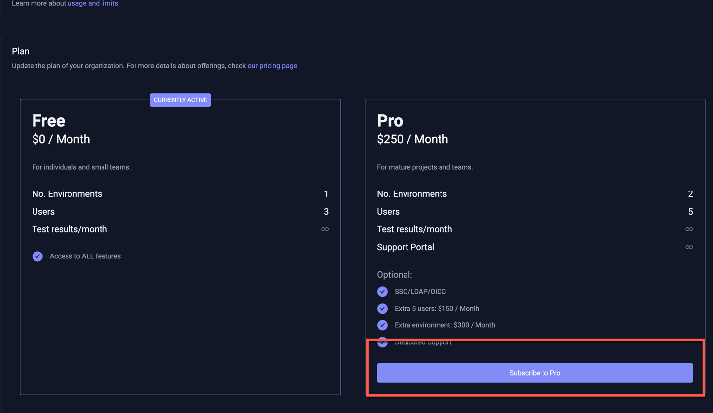

# Organization Management

To manage your organization settings click "Manage Organization" from organizations drop-down menu:


You can also create new organization. 

## Organization Settings

To edit your organization settings, click an organization from the available options from menu on the left.

### Environments

In the environments section you can see the list of your existing environments.


GREEN status means that your agent is connected successfully. 

In the case of a RED status, you can try to debug the issues with the command below:

```sh
testkube agent debug
```

Run this on your cluster where the given agent is installed.

Read more about [Environment Management](environment-management)

### Settings

In settings you can remove your organization. Keep in mind that this operation can't be rolled back!


### Members

For each organization you can define who has access and what kind of actions each member can use. 




There are 4 types of organization members: 

* `owner` - Has access to all environments and organization settings, also can access billing details.
* `admin` - Has access to all environments and organization settings.
* `biller` - Has access to billing details only.
* `member` - Has limited access to environments, access is defined by the roles assigned to given member. Member by default doesn't have any access, you need to [explicitly set it in the given environment](environment-management.md).

### Usage & Billing

This section shows your current usage against the limits of your current plan.


If you are using the cloud version of Testkube you can upgrade your plan here. 
Once on the commercial plan, you will automatically be charged for additional 
users and environments in line with the current [Pricing Model](https://testkube.io/pricing).



